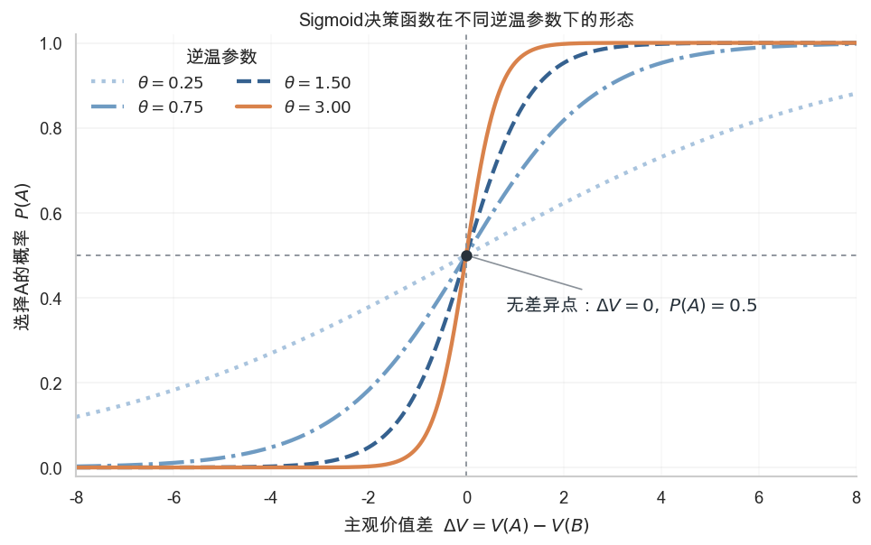
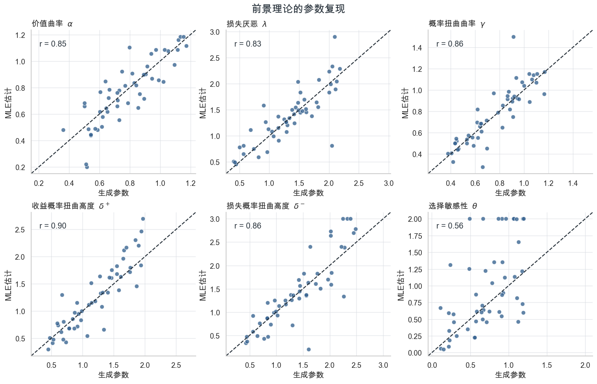

# 7.2 风险决策

## 风险决策范式

研究风险决策范式有很多类，虽然不同范式都要求被试在确定选项与赌博选项之间，或者在两个赌博选项之间做出选择，但它们之间仍然存在着许多差异。不同范式关注的是前景理论里的不同方面。例如，混合赌博范式主要用于估计损失厌恶；同时改变金额和概率，则有可能进一步估计价值函数与概率加权函数。而序列风险任务还涉及概率学习和停止策略。在接下来的部分，我们将介绍一下几类常见的风险决策范式。

### 混合赌博范式：

混合赌博范式是研究损失厌恶最常见的实验范式之一。每个试次通常包含两个选项：拒绝赌博可以获得0元；接受赌博则有50%的概率获得金额 (G)，同时有50%的概率损失金额 (L)。研究者在不同试次中改变可能收益和可能损失的大小，并记录被试是否接受赌博。

例如，一个试次可以表示为：

* 拒绝：确定获得0元；
* 接受：50%的概率获得100元，50%的概率损失60元。

如果暂时忽略价值函数曲率和概率加权，赌博的主观价值可以写为：

$$
V_{\text{gamble}}=G-\lambda L \qquad (7-12)
$$

其中，(G)和(L)分别表示收益和损失的绝对金额， $$\lambda$$是损失厌恶参数。当 $$\lambda>1$$时，等额损失对主观价值的影响大于等额收益。

这一范式的经典认知神经科学研究来自Tom et al., 2007。研究者让被试完成了一个混合赌博任务，并记录了fMRI数据。fMRI结果表明随着潜在收益增加，腹侧纹状体和部分前额叶区域的活动增强；随着潜在损失增加，同一组区域的活动总体下降。个体行为上表现出的收益—损失不对称，也与这些区域神经反应的不对称程度相关。

<figure><figcaption><p>图7-5 Tom et al., 2007的实验设计</p></figcaption></figure>

### 固定概率的金额赌博范式：

心理学和认知神经科学中还有一类常见的风险决策范式：赌博的概率在所有试次中保持不变，通常两个结果各以50%的概率发生，而确定选项和赌博结果的金额随试次变化。例如：

* 确定获得30元；
* 50%的概率获得72元，50%的概率获得0元。

这类范式因为概率被固定在50%上，前景理论和期望效用理论是等价的。这一范式把重点放在了研究价值函数曲线形态上，价值函数的参数 $$\alpha$$越小，则被试的风险厌恶越强。

<figure><figcaption><p>图7-6 Rutledge et al., 2014的实验设计</p></figcaption></figure>

Rutledge et al., 2014使用了一个典型的固定概率赌博任务，研究风险决策中的预期和结果如何影响人的瞬时幸福感。每个试次中，被试需要在一个确定选项和一个具有两个等概率结果的赌博之间选择。实验包含三类试次：

* 收益试次：在一个确定收益与“获得较大收益或获得0元”的赌博之间选择；
* 损失试次：在一个确定损失与“损失较大金额或损失0元”的赌博之间选择；
* 混合试次：在0元与一个可能收益、也可能损失的赌博之间选择。

所有赌博的两个结果均以50%的概率发生。因此，研究者只需改变不同结果的金额，就可以操纵确定收益、赌博期望价值以及结果产生的预测误差。被试每完成两到三个选择，还需要回答“你现在有多幸福？“Rutledge et al., 2014发现当前的幸福感不是由实验中已经积累的总收入决定的，而是受到近期确定收益、赌博期望价值和奖励预测误差的共同影响。

### 金额和概率均会变化的风险决策范式：

前面介绍的两类范式均只能研究前景理论的部分成分，而只有允许金额和概率均会在试次间变化的实验才能使用完整的前景理论。相较于前两类范式，这类范式可以估计概率扭曲函数。因此这类范式往往也将研究重点放在概率扭曲函数之上。例如Zilker & Pachur, 2023 令被试完成了一个Mouselab风险决策实验。在该范式中，被试在金额和概率均不同的两个赌博之间进行选择，但各项信息最初隐藏在方框中，只有将鼠标移到相应方框上时才会显示。研究者由此记录被试在金额与概率之间的“属性注意”，以及在两个赌博之间的“选项注意”，并将这些指标与前景理论的参数联系起来。Zilker & Pachur, 2023发现注意越不均衡，估计出的概率扭曲函数通常越偏离线性；而且，相似的概率扭曲曲线可能对应不同的注意模式。这表明，概率扭曲参数不仅描述选择，还可能吸收信息搜索和注意分配的影响。

<figure><figcaption><p>图7-7 Zilker &#x26; Pachur, 2023所使用的范式</p></figcaption></figure>


### 序列风险决策范式：

前面介绍的三类范式都是单轮决策任务，而现实生活中的决策往往由一系列相互关联的选择组成。常见的序列范式包括气球模拟风险任务（BART；Lejuez et al., 2002）和哥伦比亚卡片任务（CCT；Figner et a.，2009）。在BART中，被试每次为气球充气都能增加收益，但气球也可能爆炸并使当前收益归零。不过，原始BART并不明确告知爆炸概率，被试必须根据反馈逐渐学习，因此它同时涉及概率学习，更接近不确定性决策，而不是严格意义上已知概率的风险决策。CCT则明确呈现每轮中的损失卡数量、每次翻牌的收益以及翻到损失卡的损失，被试需要连续决定是否继续翻牌。由于相关风险信息均已给出，CCT能够更清楚地考察已知风险下的序列决策，并区分概率、收益和损失对停止选择的影响。不过，Pedroni et al., 2017 将CCT与其他五种风险偏好测量方法进行比较后发现，不同任务得到的风险偏好，无论以行为指标、个体排序还是前景理论参数表示，一致性都较低。这说明序列任务的表现可能包含学习、反馈和停止策略等任务特定过程，不能简单视为一种可以跨范式稳定泛化的风险偏好。

## 前景理论的应用案例

我们在前一个节的介绍了前景理论的具体函数，又在本节的前半部分介绍了一些常见风险决策范式。我们在下面通过一个模拟研究，演示如何使用在第三章介绍的最大似然估计，从决策数据中估计累积前景理论的参数，并检验模型的参数复现（parameter recovery）能力。

参数复现是检验认知模型参数可辨识性的一种常用方法。其基本思路是：首先设定一组已知的模型参数，并利用这些参数模拟生成行为数据；随后使用与真实数据分析相同的模型拟合程序，对模拟数据重新估计参数。如果重新估计得到的参数能够较好地恢复原始生成参数，则说明该模型的参数具有较好的可识别性，实际数据中得到的参数估计也更具有解释意义。相反，如果生成参数与估计参数之间的一致性较差，则表明不同参数可能产生相似的行为模式，因此对这些参数的解释需要更加谨慎。

本例采用 Zilker & Pachur, 2023 所使用的的风险决策范式：每道题包含两个赌博选项，每个选项又包含两个可能结果及其概率。实验材料同时包括纯收益、纯损失和混合赌博，金额与概率均在不同试次间变化，因此原则上可以同时估计价值函数、概率加权函数和决策函数的参数。具体的实验刺激信息可以在 Pachur et al., 2018的附录里找到。

我们首先加载一些所需要用的Python工具包，读取 Zilker & Pachur, 2023 所使用的91 道赌博题的刺激信息。

<pre class="language-python"><code class="lang-python"><strong>import numpy as np
</strong>import pandas as pd
from pathlib import Path
import matplotlib.pyplot as plt
from matplotlib import font_manager
import seaborn as sns
from scipy.optimize import differential_evolution
from scipy.special import expit
from scipy.stats import pearsonr


# ---------- seed ----------
RANDOM_SEED = 2026
rng = np.random.default_rng(RANDOM_SEED)

# ---------- 图形风格 ----------
sns.set_theme(style="whitegrid", context="notebook")
plt.rcParams.update(
    {
        "font.family": "sans-serif",
        "font.sans-serif": "Arial Unicode MS",
        "axes.unicode_minus": False,
        "figure.dpi": 120,
        "savefig.dpi": 300,
        "axes.titleweight": "bold",
        "axes.spines.top": False,
        "axes.spines.right": False,
    }
)

COLORS = {
    "blue": "#35618F",
    "orange": "#D9824B",
    "gold": "#C7A446",
    "gray": "#8A9199",
    "ink": "#27313A",
}

# ---------- 读取Pachur et al.,2018实验设计 ----------
DATA_PATH = Path("pachur_2018_gambles.csv")
gambles = pd.read_csv(DATA_PATH)

required_columns = {
    "problem_id", "ax", "ap", "ay", "aq",
    "bx", "bp", "by", "bq", "domain",
}
assert required_columns.issubset(gambles.columns)
assert len(gambles) == 91
assert np.allclose(gambles["ap"] + gambles["aq"], 1.0)
assert np.allclose(gambles["bp"] + gambles["bq"], 1.0)

gambles.head()
</code></pre>

|   | problem\_id | ax | ap   | ay | aq   | bx | bp   | by | bq   | domain |
| - | ----------- | -- | ---- | -- | ---- | -- | ---- | -- | ---- | ------ |
| 0 | 1           | 24 | 0.34 | 59 | 0.66 | 47 | 0.42 | 64 | 0.58 | gain   |
| 1 | 2           | 79 | 0.88 | 82 | 0.12 | 57 | 0.20 | 94 | 0.80 | gain   |
| 2 | 3           | 62 | 0.74 | 0  | 0.26 | 23 | 0.44 | 31 | 0.56 | gain   |
| 3 | 4           | 56 | 0.05 | 72 | 0.95 | 68 | 0.95 | 95 | 0.05 | gain   |
| 4 | 5           | 84 | 0.25 | 43 | 0.75 | 7  | 0.43 | 97 | 0.57 | gain   |

ax，ay分别是选项A的两个outcome的金额；ap，aq是选项A的两个outcome的概率。

bx，by则是选项B的两个outcome的金额；bp，bq则是选项B的两个outcome的概率。

#### 前景理论的函数

因为Zilker & Pachur, 2023 所使用的任务有两个结果，概率扭曲函数的计算方式在原始和累积前景理论是一致的。我们首先定义前景理论计算主观价值的函数：

```python
def value_function(outcome, alpha, loss_aversion):
    'CPT分段幂价值函数；参考点固定为0。'
    outcome = np.asarray(outcome, dtype=float)
    gain_value = np.clip(outcome, 0, None) ** alpha
    loss_value = -loss_aversion * np.clip(-outcome, 0, None) ** alpha
    return np.where(outcome >= 0, gain_value, loss_value)


def probability_weight(probability, gamma, delta):
    'Goldstein–Einhorn双参数概率加权函数。'
    probability = np.clip(np.asarray(probability, dtype=float), 0, 1)
    numerator = delta * probability**gamma
    denominator = numerator + (1 - probability) ** gamma
    return np.divide(
        numerator,
        denominator,
        out=np.zeros_like(numerator, dtype=float),
        where=denominator > 0,
    )
def two_outcome_cpt_value(x1, p1, x2, p2, parameters):
    # parameters依次为alpha、lambda、gamma、delta+、delta-和theta；
    # theta只用于选择函数，不参与本函数的价值计算。
    alpha, loss_aversion, gamma, delta_gain, delta_loss, _ = parameters

    x1 = np.asarray(x1, dtype=float)
    p1 = np.asarray(p1, dtype=float)
    x2 = np.asarray(x2, dtype=float)
    p2 = np.asarray(p2, dtype=float)

    v1 = value_function(x1, alpha, loss_aversion)
    v2 = value_function(x2, alpha, loss_aversion)

    both_gains = (x1 >= 0) & (x2 >= 0)
    both_losses = (x1 < 0) & (x2 < 0)
    mixed = ~(both_gains | both_losses)

    # 纯收益：最好结果获得w+(p_best)，较差结果获得1-w+(p_best)。
    first_is_better = x1 >= x2
    p_best = np.where(first_is_better, p1, p2)
    v_best = np.where(first_is_better, v1, v2)
    v_worse = np.where(first_is_better, v2, v1)
    weight_best = probability_weight(p_best, gamma, delta_gain)
    value_gains = weight_best * v_best + (1 - weight_best) * v_worse

    # 纯损失：最坏结果获得w-(p_worst)，较好结果获得1-w-(p_worst)。
    first_is_worst = x1 <= x2
    p_worst = np.where(first_is_worst, p1, p2)
    v_worst = np.where(first_is_worst, v1, v2)
    v_better = np.where(first_is_worst, v2, v1)
    weight_worst = probability_weight(p_worst, gamma, delta_loss)
    value_losses = weight_worst * v_worst + (1 - weight_worst) * v_better

    # 混合赌博：收益和损失分别使用各自的加权函数。
    first_is_gain = x1 >= 0
    p_gain = np.where(first_is_gain, p1, p2)
    p_loss = np.where(first_is_gain, p2, p1)
    v_gain = np.where(first_is_gain, v1, v2)
    v_loss = np.where(first_is_gain, v2, v1)
    value_mixed = (
        probability_weight(p_gain, gamma, delta_gain) * v_gain
        + probability_weight(p_loss, gamma, delta_loss) * v_loss
    )

    return np.where(
        both_gains,
        value_gains,
        np.where(both_losses, value_losses, value_mixed),
    )
```

与Zilker & Pachur, 2023一样，我们在这里使用了Goldstein–Einhorn-Lattimore双参数概率扭曲函数 $$w(p)=\frac{\delta p^\gamma} {\delta p^\gamma+(1-p)^\gamma}$$的，价值函数则是经典的指数函数： $$v(x)= \begin{cases} x^\alpha, & x\geq 0,\\ -\lambda(-x)^\alpha, & x<0. \end{cases}$$。

值得注意的是，模型为收益和损失分别估计 $$\delta^+$$和 $$\delta^-$$，但收益和损失共享 $$\alpha$$ 和 $$\gamma$$。

#### 决策函数

知道两个选项的主观价值以后，我们仍然不能假设决策者每次都选择价值较大的选项。如果使用完全确定的贪心策略，只要 $$V(A)$$ 大于 $$V(B)$$，模型就会预测选择 A 的概率为 1；反之则为 0。这种模型无法解释人类选择中普遍存在的随机波动，也不允许决策者偶尔选择主观价值较低的选项。在基于价值的决策任务里，通常主观价值是通过一个softmax函数映射到决策的。与贪心算法不同的是，softmax引入了决策过程中的噪音。值得一提的是，softmax也在第八章的强化学习模型里常用作决策的函数，同时也是神经网络里常见的激活函数，被用于计算Transformer的注意力权重，因此在这两章也有详细介绍。

softmax的公式为：

$$
P(i)=\frac{\exp(\theta V_i)}{\sum_j\exp(\theta V_j)} \qquad (7-13)
$$

在只有两个选项时，将分子和分母同时除以 $$exp(θV(A))$$，可以得到所谓的sigmoid函数：

$$
P(A)=\frac{1}{1+\exp[-\theta(V_A-V_B)]}
=\operatorname{sigmoid}(\theta\Delta V) \qquad (7-14)
$$

sigmoid是一条S形曲线，它把取值范围没有限制的主观价值差 $$ΔV = V(A)−V(B)$$映射到0和1之间的选择概率。当两个选项的主观价值相等，即 $$ΔV = 0$$ 时，模型预测选择A的概率为0.5；当A的主观价值逐渐高于B时， $$P(A)$$逐渐接近1；当A的主观价值低于B时， $$P(A)$$逐渐接近0。sigmoid在两端逐渐变得平缓，意味着当两个选项的价值相差已经很大时，进一步增大价值差对选择概率的影响会越来越小。

选择敏感参数 $$θ$$ 控制S形曲线在中点附近的斜率，该参数也叫逆温参数（Inverse temperature）。具体来说，曲线在 $$ΔV = 0$$处的斜率为 $$θ/4$$。因此， $$θ$$越大，曲线越陡，选择概率对较小的价值差也很敏感，决策越接近总是选择较高价值选项的贪心策略。而 $$\theta$$越小，曲线越平缓，即使两个选项存在明显的价值差，模型仍然允许出现较多不一致的选择。

我们可以画出sigmoid曲线，变化 $$θ$$和 $$ΔV$$，看他们和sigmoid输出的关系。

```python
 def choice_logit(gamble_data, parameters):
    '返回每个试次选择赌博A的logit。'
    value_a = two_outcome_cpt_value(
        gamble_data["ax"], gamble_data["ap"],
        gamble_data["ay"], gamble_data["aq"], parameters,
    )
    value_b = two_outcome_cpt_value(
        gamble_data["bx"], gamble_data["bp"],
        gamble_data["by"], gamble_data["bq"], parameters,
    )
    theta = parameters[-1]
    return theta * (value_a - value_b)


def choice_probability(gamble_data, parameters):
    'Softmax在二选一情况下等价于sigmoid。'
    return expit(choice_logit(gamble_data, parameters))
    
# 画出不同逆温参数theta下的sigmoid决策函数
value_difference = np.linspace(-8, 8, 801)
theta_values = [0.25, 0.75, 1.50, 3.00]

line_colors = ["#A9C4DE", "#6F9BC2", COLORS["blue"], COLORS["orange"]]
line_styles = [":", "-.", "--", "-"]

fig, ax = plt.subplots(figsize=(8.2, 5.2))

for theta_value, color, line_style in zip(
    theta_values, line_colors, line_styles
):
    probability_a = expit(theta_value * value_difference)
    ax.plot(
        value_difference,
        probability_a,
        color=color,
        linestyle=line_style,
        linewidth=2.6,
        label=rf"$\theta={theta_value:.2f}$",
    )

# 标出无差异点：当两个选项价值相等时，选择概率为0.5。
ax.axhline(0.5, color=COLORS["gray"], linewidth=1.1, linestyle=(0, (3, 3)))
ax.axvline(0, color=COLORS["gray"], linewidth=1.1, linestyle=(0, (3, 3)))
ax.scatter([0], [0.5], s=42, color=COLORS["ink"], zorder=5)
ax.annotate(
    r"无差异点：$\Delta V=0,\ P(A)=0.5$",
    xy=(0, 0.5),
    xytext=(0.8, 0.37),
    color=COLORS["ink"],
    arrowprops={"arrowstyle": "-", "color": COLORS["gray"], "lw": 1.0},
)

ax.set(
    title="Sigmoid决策函数在不同逆温参数下的形态",
    xlabel=r"主观价值差  $\Delta V=V(A)-V(B)$",
    ylabel=r"选择A的概率  $P(A)$",
    xlim=(-8, 8),
    ylim=(-0.02, 1.02),
)
ax.set_yticks(np.linspace(0, 1, 6))
ax.legend(title="逆温参数", frameon=False, ncol=2, loc="upper left")
ax.grid(axis="x", alpha=0.12)
ax.grid(axis="y", alpha=0.22)

fig.tight_layout()
plt.show()
```

<figure><figcaption><p>图7-8 sigmoid函数</p></figcaption></figure>

一个与softmax/sigmoid类似的决策函数是ç（power choice rule）：

$$
P(i)=\frac{V_i^\theta}{\sum_jV_j^\theta} \qquad (7-15)
$$

这二者的最大区别在于softmax/sigmoid里是对主观价值的差异敏感，幂函数决策规则对主观价值的比例敏感。举例而言，如果我们对两个选项的主观价值都加上一个值，softmax/sigmoid的预测不会改变，而幂函数决策规则会向0.5移动。同理，如果我们对主观价值都乘上一个值，softmax/sigmoid的预测会偏向价值大的选项，而幂函数则不会改变。在绝大多数任务这两者的拟合优劣都是类似的，softmax/sigmoid更为常见。

#### 模拟数据

接下来我们从均匀分布里抽取50名agent的参数，然后模拟数据：

```python
N_AGENTS = 50
N_SESSIONS = 2

true_parameters = pd.DataFrame(
    {
        "agent_id": np.arange(N_AGENTS),
        "alpha": rng.uniform(0.35, 1.20, N_AGENTS),
        "loss_aversion": rng.uniform(0.40, 2.20, N_AGENTS),
        "gamma": rng.uniform(0.35, 1.20, N_AGENTS),
        "delta_gain": rng.uniform(0.40, 2.00, N_AGENTS),
        "delta_loss": rng.uniform(0.40, 2.50, N_AGENTS),
        "theta": rng.uniform(0.10, 1.20, N_AGENTS),
    }
)

repeated_gambles = pd.concat(
    [gambles.assign(session=session) for session in range(1, N_SESSIONS + 1)],
    ignore_index=True,
)
true_parameters.head()
```

|   | agent\_id | alpha    | loss\_aversion | gamma    | delta\_gain | delta\_loss | theta    |
| - | --------- | -------- | -------------- | -------- | ----------- | ----------- | -------- |
| 0 | 0         | 0.502095 | 1.518706       | 1.042107 | 1.863130    | 2.026202    | 1.191192 |
| 1 | 1         | 0.893926 | 1.069860       | 0.464547 | 0.910051    | 1.769406    | 0.278451 |
| 2 | 2         | 0.747178 | 1.156348       | 0.873182 | 1.337423    | 0.833488    | 0.221145 |
| 3 | 3         | 0.664925 | 1.290693       | 0.692408 | 0.781992    | 1.963328    | 1.107516 |
| 4 | 4         | 0.651680 | 1.245948       | 1.001131 | 1.468768    | 2.020228    | 0.784277 |

```python
simulated_agents = []

for row in true_parameters.itertuples(index=False):
    parameters = np.array(
        [
            row.alpha, row.loss_aversion, row.gamma,
            row.delta_gain, row.delta_loss, row.theta,
        ]
    )
    agent_data = repeated_gambles.copy()
    agent_data["agent_id"] = row.agent_id
    agent_data["p_choose_a"] = choice_probability(agent_data, parameters)
    agent_data["choice_a"] = rng.binomial(1, agent_data["p_choose_a"])
    simulated_agents.append(agent_data)

simulated_data = pd.concat(simulated_agents, ignore_index=True)
simulated_data[["agent_id", "session", "problem_id", "domain", "p_choose_a", "choice_a"]].head()
```

|   | agent\_id | session | problem\_id | domain | p\_choose\_a | choice\_a |
| - | --------- | ------- | ----------- | ------ | ------------ | --------- |
| 0 | 0         | 1       | 1           | gain   | 0.328986     | 1         |
| 1 | 0         | 1       | 2           | gain   | 0.344029     | 0         |
| 2 | 0         | 1       | 3           | gain   | 0.833172     | 1         |
| 3 | 0         | 1       | 4           | gain   | 0.528637     | 0         |
| 4 | 0         | 1       | 5           | gain   | 0.420665     | 0         |

#### 估计模型参数

在模拟完数据后，我们可以使用极大似然估计去拟合模拟数据的参数。

本文的案例使用了 SciPy 的 differential evolution 函数（中文名差分进化）算法来最小化负对数似然。

常见的局部优化方法例如梯度下降法从一组初始参数出发，根据目标函数在当前位置附近的斜率不断更新参数。如果似然函数存在多个局部最优点，拟合结果就可能受到初始值影响。差分进化算法不需要计算目标函数的梯度，也不要求研究者指定唯一的一组起始参数。它首先在参数边界内生成一组候选解，也就是一个参数“种群”，然后利用不同候选解之间的差异产生新的候选参数，并通过交叉和选择保留具有较低负对数似然的解。

差分进化算法能够较广泛地搜索参数空间，但在最优点附近的收敛速度通常不如局部优化方法。因此，SciPy 的 参数polish设置为True后，会在差分进化结束后，以当前找到的最佳参数为起点，使用常见的二阶拟牛顿法优化算法L-BFGS-B在最佳候选解附近进行细调。

在接下来的code block里，我们先定义似然函数和拟合模型所需要的函数。

```python
PARAMETER_NAMES = [
    "alpha", "loss_aversion", "gamma",
    "delta_gain", "delta_loss", "theta",
]

PARAMETER_BOUNDS = [
    (0.20, 1.50),  # alpha
    (0.20, 3.00),  # loss_aversion
    (0.20, 1.50),  # gamma
    (0.20, 3.00),  # delta_gain
    (0.20, 3.00),  # delta_loss
    (0.05, 2.00),  # theta
]


def negative_log_likelihood(parameters, agent_data):
    '二项选择的负对数似然；使用logaddexp保持数值稳定。'
    logits = choice_logit(agent_data, parameters)
    choices = agent_data["choice_a"].to_numpy(dtype=float)
    return np.logaddexp(0, logits).sum() - np.dot(choices, logits)


def fit_agent(agent_data, seed):
    '用差分进化拟合一名agent。'
    return differential_evolution(
        negative_log_likelihood,
        bounds=PARAMETER_BOUNDS,
        args=(agent_data,),
        seed=seed,
        popsize=7,
        maxiter=220,
        tol=1e-5,
        polish=True,
        workers=1,
    )
```

接下来我们拟合这50名agent的模拟数据：

```python
fitted_records = []

for agent_id, agent_data in simulated_data.groupby("agent_id", sort=True):
    result = fit_agent(agent_data, seed=RANDOM_SEED + int(agent_id))
    fitted_records.append(
        {
            "agent_id": agent_id,
            **dict(zip(PARAMETER_NAMES, result.x)),
            "negative_log_likelihood": result.fun,
            "optimizer_success": result.success,
        }
    )

estimated_parameters = pd.DataFrame(fitted_records)
estimated_parameters.head()
```

|   | agent\_id | alpha    | loss\_aversion | gamma    | delta\_gain | delta\_loss | theta    | negative\_log\_likelihood | optimizer\_success |
| - | --------- | -------- | -------------- | -------- | ----------- | ----------- | -------- | ------------------------- | ------------------ |
| 0 | 0         | 0.657961 | 1.448780       | 1.149632 | 1.457743    | 1.591086    | 0.601055 | 78.124750                 | True               |
| 1 | 1         | 0.714702 | 0.994671       | 0.450329 | 1.151835    | 1.825454    | 0.572537 | 84.487712                 | True               |
| 2 | 2         | 0.922477 | 0.915545       | 0.985061 | 0.660101    | 1.199143    | 0.090199 | 110.989283                | True               |
| 3 | 3         | 0.783105 | 1.076462       | 0.716295 | 0.686659    | 1.699532    | 0.816986 | 54.425561                 | True               |
| 4 | 4         | 0.617655 | 1.318737       | 1.041270 | 1.753651    | 2.729091    | 1.038755 | 67.125110                 | True               |

#### 参数复现：

参数复现里我们比较每个参数的生成参数和拟合参数，看拟合参数是否能复现生成参数。具体而言，我们计算它们的皮尔逊相关。

```python
recovery_data = true_parameters.merge(
    estimated_parameters,
    on="agent_id",
    suffixes=("_true", "_estimated"),
)

recovery_rows = []
for parameter in PARAMETER_NAMES:
    true_value = recovery_data[f"{parameter}_true"]
    estimated_value = recovery_data[f"{parameter}_estimated"]
    correlation, _ = pearsonr(true_value, estimated_value)
    recovery_rows.append(
        {
            "参数": parameter,
            "r": correlation
        }
    )
arameter_labels = {
    "alpha": r"价值曲率  $\alpha$",
    "loss_aversion": r"损失厌恶  $\lambda$",
    "gamma": r"概率扭曲曲率  $\gamma$",
    "delta_gain": r"收益扭曲高度  $\delta^+$",
    "delta_loss": r"损失扭曲高度  $\delta^-$",
    "theta": r"选择敏感性  $\theta$",
}

fig, axes = plt.subplots(2, 3, figsize=(12.5, 8.0), constrained_layout=True)

for ax, parameter in zip(axes.flat, PARAMETER_NAMES):
    x = recovery_data[f"{parameter}_true"]
    y = recovery_data[f"{parameter}_estimated"]
    lower = min(x.min(), y.min())
    upper = max(x.max(), y.max())
    padding = 0.05 * (upper - lower)

    ax.scatter(
        x, y, s=42, color=COLORS["blue"], alpha=0.78,
        edgecolor="white", linewidth=0.7,
    )
    ax.plot(
        [lower - padding, upper + padding],
        [lower - padding, upper + padding],
        color=COLORS["ink"], linestyle="--", linewidth=1.4
    )
    correlation = recovery_summary.loc[parameter, "r"]
    ax.text(
        0.05, 0.93, f"r = {correlation:.2f}",
        transform=ax.transAxes, va="top", color=COLORS["ink"],
    )
    ax.set_title(parameter_labels[parameter], loc="left")
    ax.set_xlabel("生成参数")
    ax.set_ylabel("MLE估计")
    ax.set_xlim(lower - padding, upper + padding)
    ax.set_ylim(lower - padding, upper + padding)
    ax.grid(color="#D9DDE2", linewidth=0.8, alpha=0.75)

fig.suptitle(
    "前景理论的参数复现",
    fontsize=16, fontweight="bold", color=COLORS["ink"],
)
plt.show()

```

<figure><figcaption><p>图7-9 累积前景理论的参数复现图</p></figcaption></figure>

可以看出绝大多数参数的生成参数和估计参数之间的相关系数均大于0.8，只有选择性敏感参数 $$\theta$$的表现不佳，其相关系数只有0.56。这是因为当价值函数或概率加权函数改变了选项之间主观价值差异的尺度时， $$\theta$$可以通过向相反方向变化，产生相近的选择概率。例如，较大的价值差异配合较小的 $$\theta$$，可能与较小的价值差异配合较大的 $$\theta$$产生几乎相同的行为预测。Krefeld-Schwalb et al., 2022系统性讨论了选择性敏感参数在前景理论的问题，并提出了几种减少其可识别性问题的方案。
