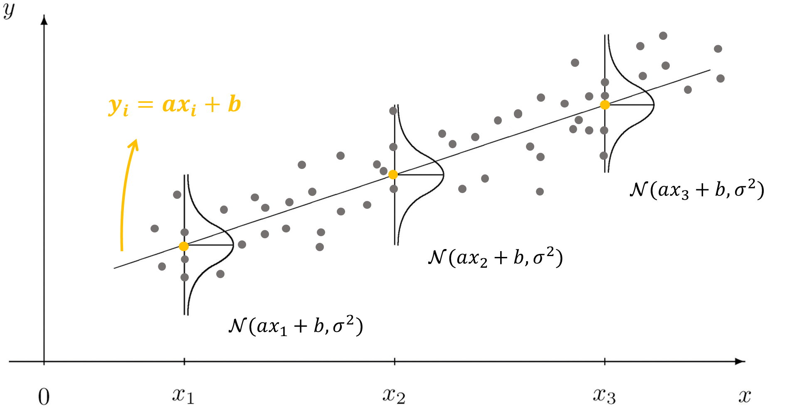

# 3.3  最大似然估计

这一节我们学习认知心理学计算建模当中最常见的**最大似然估计（maximum likelihood estimation, MLE）**&#x539F;理1。

## 洒水问题

回顾洒水问题，我们根据 $$p(O_1 \mid C_1)=0.8>p(O_1 \mid C_2)=0.6>p(O_1 \mid C_3)=0.2$$，作出了“当门口有水时，最有可能是下雨了”的推断。如果使用[上一节](3.2-si-ran-han-shu.md#lian-xu-fen-bu-xia-de-si-ran-han-shu)最后所提到的最大似然估计的视角来看待这个问题，这个问题可以被表述为 “如果 $$\theta$$ 的值域为集合 $$\{C_1, C_2, C_3\}$$，其中 $$L(\theta)=p\left(d_1 = 有水 \mid \theta\right)$$，那么当 $$\theta$$ 为何值时，$$L(\theta)$$ 最大？”。对于这个问题，我们当然可以轻松地推出，要使得 $$L(\theta)$$ 最大，那么应该选择 $$\theta = C_1(下雨)$$。

在以上过程中，我们完成了一次对离散分布下的似然函数进行最大似然估计。那么，**严格上最大似然估计该如何定义**？在刚刚的例子中，我们只关注单个数据点( $$d_1 = 有水$$ )，但在实践中我们通常面对的都是一系列数据点，**如何对一系列实验数据的似然函数进行最大似然估计呢**？

## 最大似然估计的基本概念


### _<mark style="color:orange;">最大似然估计</mark>_&#x20;

#### 已知数据 $$D = \{d_1, d_2, \dots, d_N\}$$，求其背后的参数 $$\theta$$，使其似然函数 $$L(\theta)=\prod_{i=1}^N p\left(d_i \mid \theta\right)$$ 取得最大值，即求解 $$\hat{\theta}_{\mathrm{MLE}}=\underset{\theta}{\arg\max } L(\theta)$$，该过程被称为最大似然估计。



这里 $$\arg\max$$ 表示让某函数最大的参数估计值 $$\hat{\theta}$$


在第二章中，我们学习了优化的概念，在优化问题中，我们需要使得损失函数最小。而实际上求解最大似然估计的过程同样也是优化过程。不过在具体操作上，两者存在少许差别：我们通常会对似然函数进行一些转换。

首先，对于离散数据，概率  $$p\left(d_i \mid \theta\right)$$ 一定小于等于 1，那么 $$L(\theta)=\prod_{i=1}^N p\left(d_i \mid \theta\right)$$ 连乘过后往往非常小。为了避免在数值计算过程中的数据下溢，通常我们使用 $$\log$$ 函数（本章中的 $$\log$$ 均指自然对数 $$\ln$$ ）进行变换。这是因为一方面 $$\log$$ 变换不改变函数的单调性，如下图所示，$$x^2$$ 与  $$\ln(x^2)$$ 的增减区间相同：都在 $$x<0$$ 时递减、 $$x>0$$ 时递增。

<figure><figcaption>
图 3-9
</figcaption></figure>

另一方面，$$\log(x)$$ 函数的导数是 $$x$$ 的倒数，这会使得在优化过程中计算梯度变得更加方便。

根据上一节正态分布数据的例子，进行 $$\log$$ 变换后，我们可以得到**对数似然函数(log likelihood function)**：

$$
\mathrm{LL}(\theta)=\log (L(\theta))=\log \left(\prod_{i=1}^N p\left(d_i \mid \theta\right)\right)=\sum_{i=1}^N \log \left(p\left(d_i \mid \theta\right)\right)\qquad (3-31)
$$

其次， 对于离散数据，$$p\left(d_i \mid \theta\right)$$ 小于 1，则 $$\log(p(d_i \mid \theta))$$ 小于 0，要使得小于 0 的 $$\sum_{i=1}^N \log (p(d_i\mid \theta))$$ 取得最大值，就等价于求 $$-\sum_{i=1}^N \log (p(d_i\mid \theta))$$ 的最小值。

这样，我们再在对数似然函数的前面加个负号，就得到了**负对数似然函数(negative log-likelihood function)**

$$
\mathrm{NLL}(\theta)= - \log (L(\theta)) = - \log \left(\prod_{i=1}^N p\left(d_i \mid \theta\right)\right)=-\sum_{i=1}^N \log \left(p\left(d_i \mid \theta\right)\right)\qquad (3-32)
$$

此时有，

$$
\hat{\theta}_{\mathrm{MLE}}=(\hat{\mu}, \hat{\sigma})=\underset{\theta}{\arg \max } L(\theta)=\underset{\theta}{\arg \max } \mathrm{LL}(\theta)=\underset{\theta}{\arg \min } \mathrm{NLL}(\theta)\qquad (3-33)
$$

至此，又回到了之前介绍过的优化问题，如何使得函数取得最小值，这样就能使用我们熟悉的 python minimize 函数进行求解了！

下面我们对最大似然估计进行技术总结：


### 最大似然估计的步骤

1. 根据数据生成模型写出基于参数的似然函数（**此步为最关键也是最难的一步**）
2. 将得到的似然函数变换为负对数似然函数
3. 利用 matlab 或者 python 等优化软件的数值优化方法求解。例如 python 里面的 minimize 函数，matlab 里面的 fminsearch 函数


## 最大似然估计与最小二乘法

在[先前的章节](../di-er-zhang-ji-suan-mo-xing-ji-chu/2.3-mo-xing-ni-he.md)中，我们已经学习了求解简单线性模型的最小二乘法。最小二乘法是：在线性回归中，我们通过最小化误差的平方和找到最能拟合数据的模型参数。

那么最大似然估计跟最小二乘法的关系是什么，我们先给出一个结论：


在线性回归中，当误差项（或称为噪声）满足正态分布的条件下，最大似然估计和最小二乘法在数学上是等价的


现在，我们来一步步证明这个结论：

考虑一个简单线性模型： $$y = ax + b + \epsilon$$，其中误差项 $$\epsilon$$ 服从均值为 0，标准差为 $$\sigma$$ 的正态分布（假定 $$\sigma$$ 已知）

我们从这个模型中得到了一组数据, 自变量为 $$x_1, x_2, \dots, x_N$$，因变量为 $$y_1, y_2, \dots, y_N$$，为找到能够最佳拟合这一组数据的线性模型，我们使用最小二乘法对模型参数进行求解：

$$
\underset{a, b}{\arg \min } \sum_{i=1}^N\left(y_i-\left(a x_i+b\right)\right)^2 \qquad (3-34)
$$

那么，在最大似然估计的情况下，我们要怎么来表示这个求解过程？

现在，我们将参数 $$a, b$$ 看作一个参数对 $$\theta$$ ，将数据 $$x_i, y_i$$ 看作一个数据对 $$d_i$$ ，整个数据集用 $$D$$ 表示。结合先前的内容，我们可以写作：

> 已知数据 $$D = \{d_1, d_2, \dots, d_N\}$$，其中 $$d_i = (x_i, y_i)$$，求其背后的正态分布参数 $$\theta=(a, b)$$ ，使其负对数似然函数取得最小值

但这么说并不是很直观，你或许会想，为什么这些数据点 $$(x_i,y_i)$$ 背后跟正态分布有关，跟正态分布有关的不是误差项吗？

通常来说，我们这么来表示线性模型：

$$
y =  ax+ b +\epsilon \;\;\;\;\;\epsilon \sim \mathcal{N}(0,\sigma^2)\qquad (3-35)
$$

但这可以等价写为：

$$
y \sim \mathcal{N}(\mu,\sigma^2)\;\;\;\;\; \mu = ax+b\qquad (3-36)
$$

因此，我们完全可以用正态分布来表示线性模型2

<figure><figcaption>
图 3-10 图中直线表示各点的均值 \mu_i=ax_i+b。改编自：https://saylordotorg.github.io/text_introductory-statistics/s14-03-modelling-linear-relationships.html
</figcaption></figure>

那么很显然，在给定的 $$\mu_i=ax_i+b$$,  $$\sigma$$  下，取到数据点 $$d_i = (x_i, y_i)$$ 的条件概率可以表示为：

$$
p(d_i\mid \theta) = p(y_i\mid x_i,a,b) = \frac{1}{\sqrt{2 \pi \sigma^2}} \exp \left(-\frac{\left(y_i-\mu_i\right)^2}{2 \sigma^2}\right)\qquad (3-37)
$$

代入负对数似然函数，可以表示为：

$$
\begin{aligned}
\mathrm{NLL}(\theta) & =-\mathrm{LL}(\theta) \\
& =-\log (L(\theta)) \\
& =-\log \left(\prod_{i=1}^N p\left(d_i \mid \theta\right)\right) \\
& =-\sum_{i=1}^N \log \left(p\left(d_i \mid \theta\right)\right) \\
& =-\sum_{i=1}^N \log \left(\frac{1}{\sqrt{2 \pi \sigma^2}} \exp \left(-\frac{\left(y_i-\mu_i\right)^2}{2 \sigma^2}\right)\right)\\
& = \sum_{i=1}^N\left(-\log \left(\frac{1}{\sqrt{2 \pi \sigma^2}}\right)+\frac{\left(y_i-\mu_i\right)^2}{2 \sigma^2}\right) \\
\end{aligned} \qquad (3-38)
$$

在 $$\sigma$$ 已知的情况下，其中的 $$-\log \left(\frac{1}{\sqrt{2 \pi \sigma^2}}\right)$$,  $$2 \sigma^2$$ 都为常数，在计算中可以直接省去

$$
\begin{aligned}
\underset{\theta}{\arg\min}\mathrm{NLL}(\theta) & = \underset{\theta}{\arg \min } \sum_{i=1}^N\left(y_i-\mu_i\right)^2 \\
\end{aligned}\qquad (3-39)
$$

对于每个 $$y_i$$ 来说，正态分布的均值 $$\mu_i$$ 实际上就是 $$a  x_i + b$$&#x20;

$$
\begin{aligned}
\underset{\theta}{\arg\min}\mathrm{NLL}(\theta)
& = \underset{\theta}{\arg \min } \sum_{i=1}^N\left(y_i-\mu_i\right)^2 \\
& = \underset{\theta}{\arg \min } \sum_{i=1}^N\left(y_i-\left(a x_i+b\right)\right)^2 \\
\end{aligned} \qquad (3-40)
$$

故对于误差项服从正态分布且标准差已知的简单线性模型，最大似然估计和最小二乘法在数学上是等价的。

