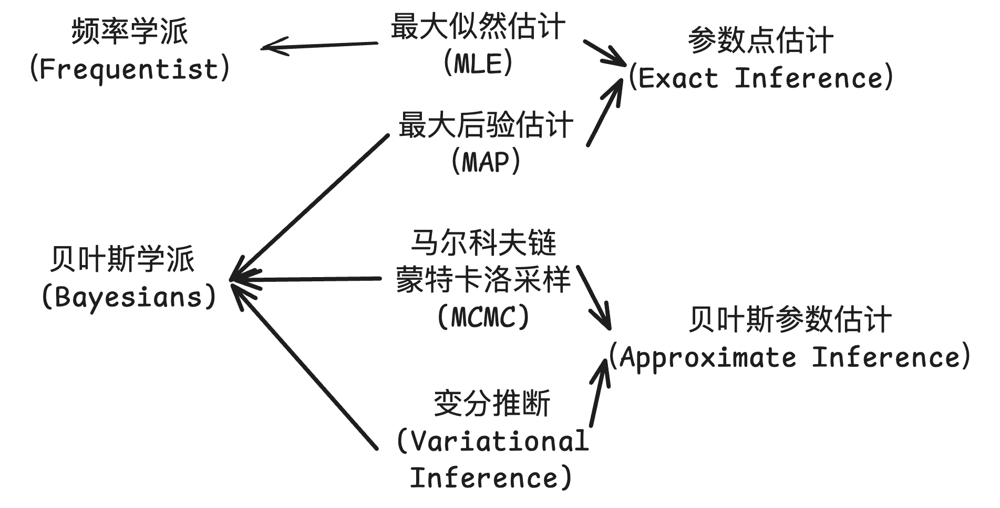

# 3.4 贝叶斯理论

在前一节，我们详细介绍了最大似然估计，它可以帮助我们进行有效推断，但它仍然有一些缺陷。

让我们再次回顾之前的例子，基于家门口有水这个数据，我们做出了下雨的推断。

<figure><figcaption></figcaption></figure>

但我们的推断存在漏洞，比如，我们从来没有考虑过“我家位于哪里” 这个问题。

1. 如果我的家在新疆乌鲁木齐，那么由经验可知我家门口有时有洒水车，但是非常少下雨。如果在我家门口发现了水，我不会在第一时间将其归因为下雨。
2. 如果我的家在撒哈拉沙漠，那么我家不仅很少下雨，而且没有洒水车。如果我家门口出现水，更可能是其他并未列出的原因。

在使用最大似然估计对数据背后的原因进行推断时，我们只考虑在各种原因下出现当前数据的可能性(即条件概率$$p(d_i|\theta))$$。但当我们考虑这些原因本身出现的可能性$$(p(\theta))$$，单纯基于使用最大似然估计做出的推断并不准确。我们需要一个新的方法来解决这个困境，贝叶斯理论就是其中的一个出路。

## 贝叶斯理论


### <mark style="color:orange;">贝叶斯理论</mark>

贝叶斯理论通常被表述为3：

$$
p(\theta|d) = \frac{p(d|\theta)p(\theta)}{p(d)}  \qquad (3-41)
$$

* $$p(\theta)$$为先验分布，它是某个假设发生的概率分布。
* $$p(d|\theta)$$是我们熟悉的似然函数。
* $$p(d)$$为归一化因子，也就是我们之前提到的边际概率，表示该数据本身发生的概率。
* $$p(\theta|d)$$是后验概率，是基于数据对于参数的推断。


还是以家门口有水为例，现在我们将假设发生的概率纳入考虑，假设我家所在的区域很少下雨，且几乎不出现洒水车。

> 注意，这里为了便于计算，我们只取单个数值代入上述公式，来计算 $$p(C_1|O_1)$$，常见的情况往往涉及到分布之间相乘，在此不作介绍。

<figure><figcaption></figcaption></figure>

$$
\begin{aligned}
p(C_1|O_1)& = \frac{p(O_1|C_1) * p(C_1)}{p(O_1)}
\\
& = \frac{p(O_1|C_1) * p(C_1) }{p(O_1|C_1) * p(C_1) + p(O_1|C_2) * p(C_2) + p(O_1|C_3) * p(C_3)}\\
& = \frac{0.16}{0.16+0.06+0.18}\\\\
& =  0.4
\end{aligned}
$$

同样地，我们可以计算出$$p(C_2|O_1) = 0.15, \;\; p(C_3|O_1) = 0.45,$$  &#x20;

$$p(C_3|O_1) > p(C_1|O_1) > p(C_2|O_1)$$   此时若观察到家门口有水，最可能发生的事情不再是下雨。

通过上面这个计算我们也能更好地理解 “为什么$$p(d)$$被称为归一化因子”，由于$$p(d)$$是一个用来归一化的常数，且它并不受$$\theta$$影响，在计算中我们常省略它。因此贝叶斯公式有时也写作：

$$
p(\theta \mid d) \propto p(d \mid \theta) * p(\theta), \propto表示成比例\qquad (3-42)
$$

## 最大后验估计

因此，在贝叶斯公式下，我们将先验分布和似然函数结合起来，求出后验概率分布，并找到能使后验概率分布最大的参数值，这被称为**最大后验估计 (maximum A Posterior, MAP)** ，我们同样使用最大后验估计来对数据背后的原因进行推断。

$$
\begin{aligned}
\hat{\theta} & =\underset{\theta}{\arg \max } p(\theta \mid d) \\
& =\underset{\theta}{\arg \max }(p(d \mid \theta) * p(\theta))
\end{aligned}\qquad (3-43)
$$

## 最大似然估计 vs 最大后验估计

我们接着最大后验估计的公式往下写：

$$
\begin{aligned}
{\hat{\theta}_{MAP}} & =\underset{\theta}{\arg \max } p(\theta \mid d) \\
& =\underset{\theta}{\arg \max }(p(d \mid \theta) * p(\theta))\\
& =\underset{\theta}{\argmax} (\sum_i^n \log (p(d_{i}|\theta)) + \log (p(\theta))\;)\\ 
\end{aligned}\qquad (3-44)
$$

当先验分布为均匀分布时，$$\log(p(\theta))$$是一个常数，在优化中可以忽略，此时最大后验估计在数学上等价于最大似然估计。

$$
\begin{aligned}
{\hat{\theta}_{MAP}} & =\underset{\theta}{\arg \max } p(\theta \mid d) \\
& =\underset{\theta}{\arg \max }(p(d \mid \theta) * p(\theta))\\
& =\underset{\theta}{\argmax} (\sum_i^n \log (p(d_{i}|\theta)) + \log (p(\theta))\;)\\
& = \underset{\theta}{\argmax}(\sum_i^n \log (p(d_{i}|\theta))) + const \\      
& = \underset{\theta}{\argmax}(\sum_i^n \log (p(d_{i}|\theta)))   \\
& = \hat{\theta}_{MLE}
\end{aligned}\qquad (3-45)
$$

## 贝叶斯学派与频率学派

通过上述的计算，其实我们可以看出最大似然估计和最大后验估计对参数（即假设发生的概率）有着不同的理解，最大似然估计将参数的视为均匀分布，即参数的发生是一个未知但固定的值，如 $$p(\theta) = \frac{1}{6}$$。这样的思想来自于频率学派，在频率学派中，概率是在无数次重复抽样后得到的预期值。

而最大后验估计对参数的理解则对应着贝叶斯学派。贝叶斯学派认为概率是对事件发生的信心，它会受到先验概率和当前观察到的数据的影响，不断更新。

这两个学派都各自发展出了许多统计推断方法，例如本章所讲述的最大似然估计和最大后验估计，它们均用于估计某个统计量的取值，属于参数点估计。本书的第五章章节还会介使用贝叶斯方法进行近似推断估计关于参数的整个分布。 

<figure><figcaption>
图 3-11 马尔可夫链蒙特卡洛采样（MCMC）和变分推断（Variational inference）将在本书后面的内容中详细介绍。
</figcaption></figure>
