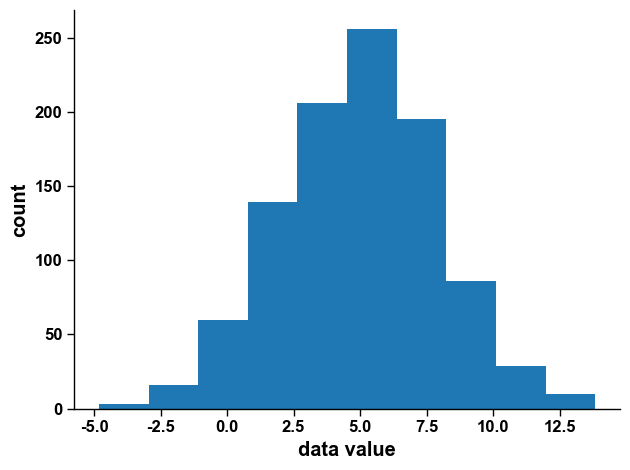
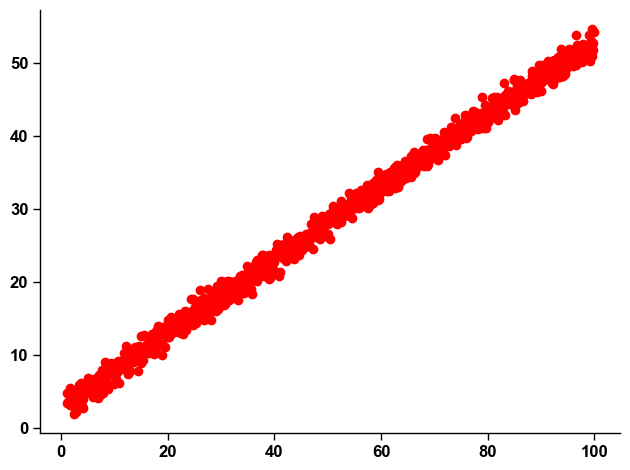

# 3.5 编程练习-最大似然估计

### 最大似然估计

这一节我们演示如何利用最大似然估计(maximum likelihood estimation)的方法来估计一组数据背后的高斯分布

首先我们生成数据：


```python
from scipy.stats import norm
import matplotlib.pyplot as plt

sigma = 3 # 高斯分布的标准差
u = 5 # 均值

normobj = norm(loc=u, scale=sigma) # 定义一个高斯分布
data = normobj.rvs(size=1000) # 从高斯分布中采样1000个数据
```


随后对数据数据进行简单可视化：


```python
plt.hist(data)
plt.ylabel('count')
plt.xlabel('data value')
```



> <p align="center"><br><sub>图 3-12</sub></p>

现在我们假定分布的均值未知，利用数据来估计均值的值。

首先写出负对数似然函数(negative log-likelihood function)：


```python
def negloglikeli(params):
    # data 和sigma是已知的，params(即均值)是需要传入的
    likeli = norm.pdf(data, loc=params, scale=sigma)
    
    loglikeli = np.log(likeli).sum()
    # 对总的log likeli值取负，最大化loglikeli就等于最小化负loglikeli
    nll = -loglikeli 

    return nll
```


我们将不同的均值传入定义的函数，看其得出的负对数似然值，可以看到当$$\mu$$=5时，负对数似然函数取到最小值。


```python
# 输入不同的mu值
mu = np.arange(0,10) 
nll = []
# 储存不同的mu值对应的负对数似然函数值
for i in mu:
    nll.append(negloglikeli(i)) 
#可视化
plt.plot(nll) 
plt.ylabel('negative log-likeli')
plt.xlabel('mu')
```


> <p align="center"><br><sub>图 3-13</sub></p>

或者我们也可以直接使用scipy 中的minimize函数，来直接找到使得负对数似然函数取到最小的mu值。


```python
from scipy.optimize import minimize
res = minimize(fun=negloglikeli, x0=(3,))
print('The estimated mean of the distribution is', res.x[0])
```


> The estimated mean of the distribution is 4.9821100894980646

## 用最大似然估计解决线性回归问题

假定$$y =0.5x+3$$，我们生成$$x$$与对应的$$y$$并进行可视化。


```python
import numpy as np
a = 0.5 # 系数
b = 3   # 截距
noiseStd = 1 # noise的标准差
x = np.arange(1, 100, 0.1) #生成x值
y =  a * x + b + noiseStd* np.random.randn(x.size) #代入公式生成对应的y

#可视化
plt.plot(x, y, 'o', color='r')
```


> <p align="center"><br><sub>图 3-14</sub></p>

我们先复习一下上一章讲的最小二乘法求解线性回归问题：


```python
# 构建loss函数
def loss(params):
    # params是个(2,)的数组, 第一个是斜率，第二个是截距
    a = params[0]
    b = params[1]

    y_pred = a * x + b

    return ((y-y_pred)**2).sum() # 计算squared error作为loss函数

from scipy.optimize import minimize
# minimize会自动寻找让loss取得最小值的两个参数
res = minimize(fun=loss, x0=(1, 1))
print('Linear coefficient is', res.x[0])
print('Intercept is', res.x[1])
```


> Linear coefficient is 0.5008892586858943&#x20;
>
> Intercept is 2.943209971344448

下面用最大似然估计来求解线性回归问题：


```python
from scipy.optimize import minimize
from scipy.stats import norm
eps = np.finfo(float).eps

rv = norm() # 创建一个正态分布的对象

def lossfun2(params):
    # params是个(2,)的数组, 第一个是斜率，第二个是截距
    a = params[0]
    b = params[1]

    y_pred = a * x + b

    pp = norm.pdf(y, loc=y_pred, scale=noiseVar)
    
    pp = 0.999*pp + eps # 防止概率过小结果变成inf
    
    negloglikeli = -np.log(pp).sum()
    
    return negloglikeli # 计算negative log likelihood作为loss函数

res = minimize(fun=lossfun2, x0=(1, 1))
print('Linear coefficient is', res.x[0])
print('Intercept is', res.x[1])
```


> Linear coefficient is 0.5008892577373644&#x20;
>
> Intercept is 2.943210034713618

可以看到，两者的结果非常接近，实际上两者在数学上是完全等价的。
