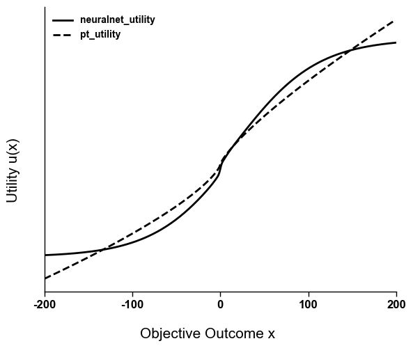
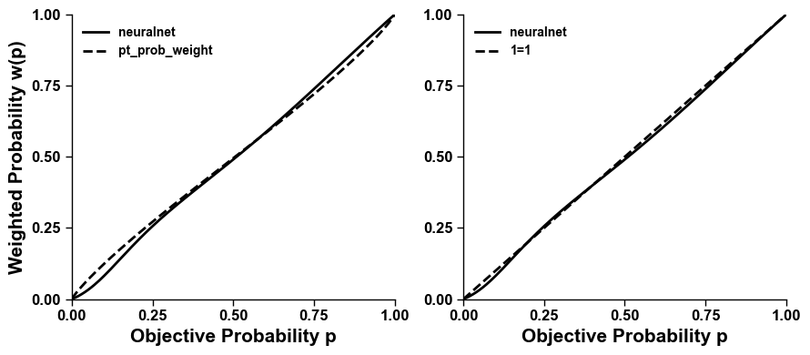

# 10.2.3 价值决策

我们

```python
import json
import numpy as np
import pandas as pd
from sklearn.model_selection import train_test_split
from scipy.optimize import minimize
import matplotlib.pyplot as plt
from torch import nn
import torch
from IPython.display import display, clear_output
import matplotlib.ticker as ticker
from scipy.stats import zscore
```

```python
np.random.seed(1234)  
torch.manual_seed(1234) 

# 加载数据并划分为训练集和测试集
with open('mlp_example.json', 'r', encoding='utf-8') as f:
    data = json.load(f)[:2000]

train_data, test_data = train_test_split(data, test_size=0.2, random_state=1234)
```

```python
# 可视化决策问题，展示两个赌博选项的详细信息
def print_problem(problem_list, problem_index): 
    entry = problem_list[problem_index]
    gA, gB = entry['A'], entry['B']
    
    gambleA = pd.DataFrame(gA, columns=["Probability", "Payout"]).sort_values("Probability", ascending=False)
    gambleB = pd.DataFrame(gB, columns=["Probability", "Payout"]).sort_values("Probability", ascending=False)
    
    linesA = gambleA[["Payout", "Probability"]].to_string().split("\n")
    linesB = gambleB[["Payout", "Probability"]].to_string().split("\n")
    
    # 打印问题标题和选择B的概率（bRate）
    print("{:^55}".format(f"Problem {problem_index}"))
    print("{:^55}".format(f"bRate = {entry['bRate']:.4f}"))  # bRate表示选择选项B的概率
    print(f"\n{'Gamble A':^25} {'Gamble B':>20}")
    
    # 并排打印两个赌博选项的信息
    for i in range(max(len(linesA), len(linesB))):
        a_str = "" if i >= len(linesA) else linesA[i]
        b_str = "" if i >= len(linesB) else linesB[i]
        print(f"{a_str:<25} {b_str:>25}")


for i in range(min(5, len(data))):
    print_problem(data, i)
    print("-" * 60)
```


```
                       Problem 0                       
                    bRate = 0.6267                     

        Gamble A                      Gamble B
   Payout  Probability          Payout  Probability
0    26.0         0.95       0    21.0         0.95
1    -1.0         0.05       1    23.0         0.05
------------------------------------------------------------
                       Problem 1                       
                    bRate = 0.6118                     

        Gamble A                      Gamble B
   Payout  Probability          Payout  Probability
0     2.0          0.5       0     1.0          1.0
1     0.0          0.5                             
------------------------------------------------------------
                       Problem 2                       
                    bRate = 0.2222                     

        Gamble A                      Gamble B
   Payout  Probability          Payout  Probability
1     8.0         0.95       0   -31.0        0.750
0    37.0         0.05       1    86.5        0.125
                             2    87.5        0.125
------------------------------------------------------------
...
   Payout  Probability          Payout  Probability
0    27.0          1.0       0   -24.0          0.5
1    27.0          0.0       1    89.0          0.5
------------------------------------------------------------
```


## 基于前景理论的模型

```python
# Utility function
def utility(x, alpha, beta, lam):
    x = np.asarray(x, dtype=float)
    u = np.empty_like(x)
    gain = x >= 0
    loss = ~ gain
    u[gain] = x[gain] ** alpha  # 收益的效用
    u[loss] = -lam * (-x[loss]) ** beta  # 损失的效用（损失厌恶）
    return u

# 概率权重函数：将客观概率转换为主观概率权重
def prob_weight(p, gamma):
    p = np.asarray(p, dtype=float)
    p = np.clip(p, 1e-10, 1 - 1e-10)
    num = p ** gamma
    den = (p ** gamma + (1 - p) ** gamma) ** (1 / gamma)
    return num / den

# 计算主观价值：加权概率 × 效用值的加权和
def compute_SV(gamble, alpha, beta, lam, gamma):
    probs = np.array([g[0] for g in gamble])
    payouts = np.array([g[1] for g in gamble])
    probs = probs / probs.sum()
    utilities = utility(payouts, alpha, beta, lam)
    w_probs = prob_weight(probs, gamma)
    w_probs = w_probs / w_probs.sum()
    return np.sum(w_probs * utilities)

# 将主观价值差异转换为选择概率
def softmax(SV_A, SV_B, eta):
    diff = np.clip(eta * (SV_B - SV_A), -40, 40)
    return 1 / (1 + np.exp(-diff))

# 预测函数：预测选择B的概率
def predict(entry, alpha, beta, lam, gamma, eta):
    SV_A = compute_SV(entry['A'], alpha, beta, lam, gamma)
    SV_B = compute_SV(entry['B'], alpha, beta, lam, gamma)
    pred = softmax(SV_A, SV_B, eta)
    return np.clip(pred, 1e-10, 1 - 1e-10)

# 负对数似然损失函数
def loss(params, data):
    alpha, beta, lam, gamma, eta = params
    nll = 0
    for entry in data:
        pred = predict(entry, alpha, beta, lam, gamma, eta)
        truth = np.clip(entry['bRate'], 1e-10, 1 - 1e-10)
        nll -= truth * np.log(pred) + (1 - truth) * np.log(1 - pred)
    return nll

# 计算均方误差
def compute_mse(data, model, params):
    pred = np.array([model(entry, *params) for entry in data])
    truth = np.array([entry['bRate'] for entry in data])
    return np.mean((pred - truth) ** 2)
```

定义了以上函数之后，我们来在数据上优化这个模型

```python
# 优化前景理论参数 [alpha, beta, lam, gamma]
initial_params = [0.8, 0.8, 2.0, 0.7, 3.0]
# 参数边界
bounds = [(0.01, 2), (0.01, 2), (0.01, 10), (0.01, 2), (0.01, 10)]
result = minimize(loss, initial_params, args=(train_data,), method='L-BFGS-B', bounds=bounds)

# 评估模型性能
mse = compute_mse(test_data, predict, result.x)
print(f"Best parameters: {result.x}")
print(f"Test Set Mean Squared Error: {mse:.3f}")
```


```
Best parameters: [0.79336726 0.72447385 1.13836745 0.88705109 0.27996258]
Test Set Mean Squared Error: 0.023
```


## 基于神经网络的价值决策模型

前面的

```python
# Utility Network
class UtilityNetwork(nn.Module):
    def __init__(self, input_dim=1, hiddendim=10, output_dim=1):
        super(UtilityNetwork, self).__init__()
        self.fc1 = nn.Linear(input_dim, hiddendim)
        self.fc2 = nn.Linear(hiddendim, output_dim)
        
        nn.init.xavier_uniform_(self.fc1.weight)
        nn.init.xavier_uniform_(self.fc2.weight)
        nn.init.zeros_(self.fc1.bias)
        nn.init.zeros_(self.fc2.bias)
    
    def forward(self, x):
        x = torch.sigmoid(self.fc1(x))
        x = self.fc2(x)
        return x

# Probability Network
class ProbabilityNetwork(nn.Module):
    def __init__(self, input_dim=1, hiddendim=10, output_dim=1):
        super(ProbabilityNetwork, self).__init__()
        self.fc1 = nn.Linear(input_dim, hiddendim)
        self.fc2 = nn.Linear(hiddendim, output_dim)
        nn.init.xavier_uniform_(self.fc1.weight)
        nn.init.xavier_uniform_(self.fc2.weight)
        nn.init.zeros_(self.fc1.bias)
        nn.init.zeros_(self.fc2.bias)

    def forward(self, x):
        x = torch.sigmoid(self.fc1(x))
        x = torch.sigmoid(self.fc2(x))
        return x

# 计算主观价值（使用神经网络）
def compute_SV(gamble, utility_net, probability_net, device='cpu'):
    probs = torch.tensor([g[0] for g in gamble], dtype=torch.float32, device=device)
    outcomes = torch.tensor([g[1] for g in gamble], dtype=torch.float32, device=device)
    probs = probs.unsqueeze(-1)
    outcomes = outcomes.unsqueeze(-1)

    utilities = utility_net(outcomes)
    w_probs = probability_net(probs)

    SV = torch.sum(utilities * w_probs)
    return SV

# 预测选择概率
def predict(entry, utility_net, prob_net, eta, device='cpu'):
    SV_A = compute_SV(entry['A'], utility_net, prob_net, device)
    SV_B = compute_SV(entry['B'], utility_net, prob_net, device)

    diff = torch.clamp(eta * (SV_B - SV_A), -40, 40)
    pB = 1 / (1 + torch.exp(-diff))
    return torch.clamp(pB, 1e-10, 1 - 1e-10)

# 实时显示训练损失曲线
def render(history):
    clear_output(wait=True)
    fig, ax = plt.subplots(1, 1, figsize=(10, 5))
    epochs = range(1, len(history)+1)
    ax.plot(epochs, history, label='Training Loss', color='#ac6f82', linewidth=6, alpha=0.8)
    ax.set_xlabel('Epochs', fontsize=17, fontweight='bold')
    ax.set_ylabel('Mean Squared Error', fontsize=17, fontweight='bold')
    ax.yaxis.set_major_formatter(ticker.FuncFormatter(lambda x, pos: f'{x:.3f}'))
    for spine in ['top', 'right']:
        ax.spines[spine].set_visible(False)
    for spine in ['bottom', 'left']:
        ax.spines[spine].set_linewidth(2.5)
    ax.tick_params(axis='both', which='major', labelsize=12)
    ax.legend()
    plt.tight_layout()
    display(fig)
    plt.close(fig)

# Train the model
def train(train_data, epochs=100, lr=0.001, eta_init=1.0, device='cpu'):
    # 初始化模型
    utility_net = UtilityNetwork(input_dim=1, hiddendim=10, output_dim=1).to(device)
    prob_net = ProbabilityNetwork(input_dim=1, hiddendim=10, output_dim=1).to(device)
    eta = nn.Parameter(torch.tensor(eta_init, dtype=torch.float32, device=device))

    # 优化器
    optimizer = torch.optim.Adam(
        list(utility_net.parameters()) + list(prob_net.parameters()) + [eta],
        lr=lr
    )

    # 训练循环
    training_loss = []
    for epoch in range(epochs):
        utility_net.train()
        prob_net.train()
        total_loss = 0
        
        for entry in train_data:
            optimizer.zero_grad()
            pred = predict(entry, utility_net, prob_net, eta, device)
            truth = torch.clamp(torch.tensor(entry['bRate'], dtype=torch.float32, device=device), 
                               1e-10, 1 - 1e-10)
            loss = torch.mean((pred - truth) ** 2)
            loss.backward()
            optimizer.step()
            total_loss += loss.item()

        avg_loss = total_loss / len(train_data)
        training_loss.append(avg_loss)
        render(training_loss)

    return utility_net, prob_net, eta, training_loss

# 计算均方误差
def compute_mse(data, utility_net, prob_net, eta, device='cpu'):
    predictions = []
    observations = []
    with torch.no_grad():
        for entry in data:
            pred = predict(entry, utility_net, prob_net, eta, device)
            predictions.append(pred.cpu().item())
            observations.append(entry['bRate'])
    predictions = np.array(predictions)
    observations = np.array(observations)
    test_mse = np.mean((predictions - observations) ** 2)
    return test_mse
```

基于上面的模型定义，我们现在来优化训练模型

```python
# 训练神经网络模型
utility_net, prob_net, eta, training_loss = train(train_data, 
                                                    epochs=200,
                                                    lr=0.001,
                                                    device='cpu')
# 评估模型性能
mse = compute_mse(test_data, utility_net, prob_net, eta, device='cpu')
print(f"Test Set Mean Squared Error: {mse:.3f}")
```

<figure><figcaption></figcaption></figure>

上面的图让我们可以在训练过程中可视化训练的损失下降的过程


```
Test Set Mean Squared Error: 0.023
```


## 比较前景理论和神经网络的函数

在用传统的前景理论概率模型和神经网络模型拟合了数据之后，我们来看看得到的价值函数和概率权重函数有什么区别。

## 价值函数比较

```python
# 可视化：比较神经网络学习的价值函数与前景理论的价值函数
outcomes = torch.arange(-200, 200, dtype=torch.float32).unsqueeze(-1)

utility_net.eval()
with torch.no_grad():
    neuralnet_utility = utility_net(outcomes)

alpha, beta, lam = result.x[0], result.x[1], result.x[2]
pt_utility = utility(outcomes.squeeze().detach().cpu().numpy(), alpha, beta, lam)

fig, ax = plt.subplots(1, 1, figsize=(6, 5))
ax.plot(outcomes.squeeze().detach().cpu().numpy(), zscore(neuralnet_utility.squeeze().detach().cpu().numpy()), '-', color='black')
ax.plot(outcomes.squeeze().detach().cpu().numpy(), zscore(pt_utility), '--', color='black')
ax.set_xlim(-200, 200)
ax.set_xticks(list(range(-200, 201, 100)))
ax.set_yticks([])
ax.legend(['neuralnet_utility','pt_utility'])
fig.supxlabel('Objective Outcome x', fontsize=15)
fig.supylabel('Utility u(x)', fontsize=15)
plt.tight_layout()
plt.show()
```

<figure><figcaption></figcaption></figure>

仔细观察上面的函数，我们发现神经网络的价值函数会相比于前景理论的假定更明显的S型的函数。这样的函数形式是很难用传统的函数形式去总结的，而神经网络可以在不加任何函数形式假设的情况下拟合这条函数。

### 概率权重函数比较

```python
# 比较神经网络学习的概率权重函数与前景理论的概率权重函数
probs = torch.linspace(0, 1, 200, dtype=torch.float32).unsqueeze(-1)

prob_net.eval()
with torch.no_grad():
    neuralnet_prob_weight = prob_net(probs)
# 归一化到[0,1]范围以便比较
neuralnet_prob_weight = (neuralnet_prob_weight - neuralnet_prob_weight.min()) / (neuralnet_prob_weight.max() - neuralnet_prob_weight.min())

gamma = result.x[3]
pt_prob_weight = prob_weight(probs.squeeze().detach().cpu().numpy(), gamma)

fig, ax = plt.subplots(1, 2, figsize=(9, 4))
ax[0].plot(probs.squeeze().detach().cpu().numpy(), neuralnet_prob_weight.squeeze().detach().cpu().numpy(), '-', color='black')
ax[0].plot(probs.squeeze().detach().cpu().numpy(), pt_prob_weight, '--', color='black')
ax[0].set_xlim(0, 1)
ax[0].set_ylim(0, 1)
ax[0].set_xticks([0, 0.25, 0.5, 0.75, 1.0])
ax[0].set_yticks([0, 0.25, 0.5, 0.75, 1.0])
ax[0].legend(['neuralnet','pt_prob_weight'])
ax[0].set_xlabel('Objective Probability p', fontsize=15)
ax[0].set_ylabel('Weighted Probability w(p)', fontsize=15)

ax[1].plot(probs.squeeze().detach().cpu().numpy(), neuralnet_prob_weight.squeeze().detach().cpu().numpy(), '-', color='black')
ax[1].plot(probs.squeeze().detach().cpu().numpy(), probs.squeeze().detach().cpu().numpy(), '--', color='black')
ax[1].set_xlim(0, 1)
ax[1].set_ylim(0, 1)
ax[1].set_xticks([0, 0.25, 0.5, 0.75, 1.0])
ax[1].set_yticks([0, 0.25, 0.5, 0.75, 1.0])
ax[1].legend(['neuralnet','1=1'])
ax[1].set_xlabel('Objective Probability p', fontsize=15)


plt.tight_layout()
plt.show()
```

<figure><figcaption></figcaption></figure>

上面左图我们把神经网络和前景理论得到的概率权重函数进行比较，我们发现实际上神经网络得到的概率权重函数似乎更加接近对角线。右图我们把神经网络得到的概率权重函数和对角线等比函数进行比较，发现差别并没有想的那么大。这些结果非常意外，说明在大量数据，以及每个选项存在多个可能结果的情况下，可能传统理论认为的人脑的概率权重扭曲现象并不是那么明显。
