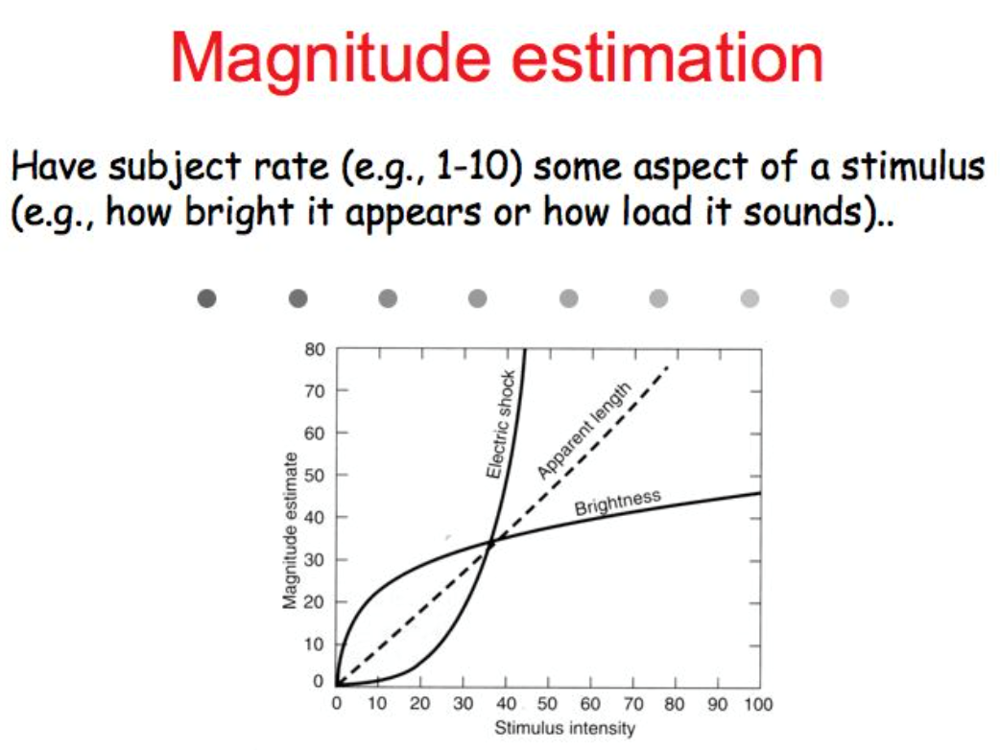
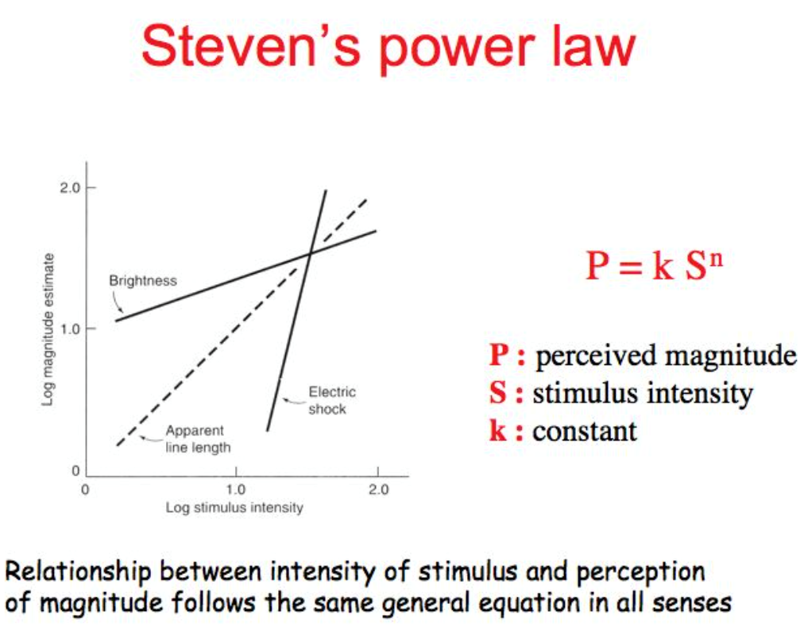
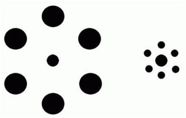
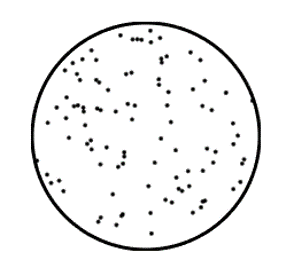
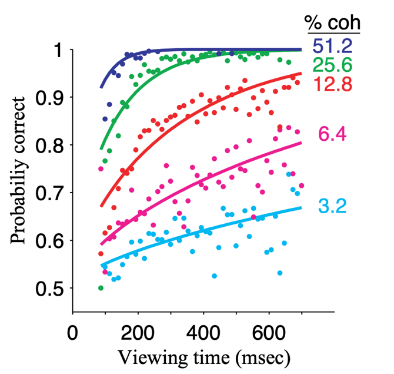

# 4.1 心理物理学基础

在讲知觉决策之前，我们不妨来回顾一下实验心理学中学过的心理物理学知识。

心理物理学（Psychophysics）是研究物理刺激（如声音、光线、温度等）与主观感知（如响度、亮度、温度感受等）之间关系的科学学科。它探讨了如何通过定量方法测量外界物理特性与个体心理体验之间的映射关系，从而揭示感知系统的工作机制及其特性。

在心理物理学中，有很多实验方法用来量化物理刺激与主观感知之间的关系。以下是几个常见的例子：

## **幅度估计（Magnitude Estimation）**

被试者根据某个特定刺激的属性（如亮度或响度）进行主观打分。通常要求被试者在一个预设的尺度上（例如1到10）为刺激的强度进行评分，从而量化主观感受与物理刺激之间的关系。例如，让被试者为不同亮度的光源打分，以评估光亮程度在主观上的变化。

<figure><figcaption>
图1 对亮度的幅度估计
</figcaption></figure>

Steven幂定律（Steven's Power Law）就描述了物理刺激强度与主观感知强度之间的数学关系。该定律表明，不同类型的感官刺激（如声音、亮度、压力）与感知强度之间的关系可以通过不同的指数n来描述。当n>1时，感知强度增长得比物理刺激强度更快（如电击感）；当n<1时，感知强度增长得比物理刺激强度更慢（如亮度感知）。

<figure><figcaption>
图2 Steven幂定律
</figcaption></figure>

## **匹配（Matching）**

被试者调整一个刺激的某个属性（如大小或响度），直到该刺激在某个方面（如视觉或听觉感知）与另一个刺激相匹配。这个方法用于研究个体在不同感知条件下的主观相等点（point of subjective equality, PSE）。例如，要求被试者调整右边中心圆形的大小，直到它与左边中心圆形看起来一样大。

<figure><figcaption>
图3 匹配任务中的大小调整
</figcaption></figure>

## **检测与区分（Detection/Discrimination）**

### 检测

被试者判断某个刺激是否存在。通常用于测量感知系统的检测阈限（detection threshold），例如询问被试者是否能听到某个特定音量的声音。

### 区分

被试者判断两个刺激中哪一个更强或更弱，或者哪个具有不同的特征。这种方法常用于测量差别阈限（difference threshold），例如判断两个音调中哪个音调更高。

常见的实验方法有调整法（Method of Adjustment）、Yes-No任务、强迫选择任务（Forced Choice Task）等。

### 调整法

被试可以主动调节某个刺激属性（如亮度、音量），直到达到某种主观标准或感知阈限。研究人员记录被试者在多次调节中的平均值作为感知阈限或差别阈限。这种方法可以快速测量感知阈限，但容易受到被试者偏好和操作习惯的影响，因此结果的精确度相对较低。例如在检测任务中，被试调节一个逐渐增强或减弱的刺激（如声音），直到他们能刚好听到/看见它；而在区分任务中，被试调整两个刺激之间的差异，直到两者在某个方面（如亮度）被感知为相等。

### Yes-No任务

在yes-no任务中，被试在每次试验中都会接收到一个刺激，并需要回答“是”或“否”，以表示他们是否检测到了该刺激。研究人员通过一系列刺激强度（使用恒定刺激法）来测量感知阈限，并绘制心理测量函数（psychometric function）来描述被试者对不同刺激强度的反应概率。

### 迫选任务

在强迫选择任务中，被试在每个试验中需要从多个选项中进行选择（通常为2选1或4选1），例如判断两个刺激中哪一个更强。这种方法的特点是排除了选择标准的影响，因为被试者必须在给定选项中做出选择，而不是自由地选择“是”或“否”。例如在区分任务中，被试需要判断两个刺激中哪个更亮、哪个更响等；而在检测任务中，被试在一个2选1的任务中，需要判断其中哪一个时间段存在刺激。

## **感知决策（Perceptual decision-making）**

随机点运动图（Random Dot Kinematograms, RDK）是感知决策研究中最经典的实验范式之一。RDK通常用于研究个体在视觉感知中的运动方向判断过程。在RDK实验中，被试者看到一个由多个随机排列的点组成的动态图形，这些点中一部分会沿特定方向（如左或右）运动，而其余点则随机移动（噪声）。被试者需要判断这些点的整体运动方向。实验中可以通过改变沿相同方向运动的点的比例（称为一致性水平，coherence level）来调节任务难度：一致性水平越高，判断越容易；一致性水平越低，判断越困难。

<figure><figcaption>
图4 随机点运动图
</figcaption></figure>

RDK范式能够揭示被试者在面对不确定性和噪声信息时如何进行决策，并用于分析感知过程中神经系统如何整合信息、权衡证据，最终做出决策。这种实验通常与行为数据及神经数据（如神经放电频率、fMRI信号）结合，帮助理解决策机制的神经基础。下面我们给出一个利用RDK研究感知证据累计过程的经典研究。

<figure><figcaption></figcaption></figure>

在Gold & Shadlen (2004)的经典研究中，RDK（随机点运动图）范式被用来研究感知决策的动态过程。该研究通过操控随机点中朝一致方向运动的点的比例（即一致性水平），揭示了感知决策中证据积累的机制。曲线关系反映了感知决策中证据积累模型（Evidence Accumulation Model）的特点。在RDK任务中，被试者通过积累视觉感知中的运动方向信息来做出决策。不同一致性水平对应的证据强度不同，因此影响了被试者积累证据的速度和判断的正确性。高一致性水平的证据较强，积累速度快，所需决策时间短，正确率高。低一致性水平的证据较弱，积累速度慢，所需决策时间长，正确率较低。

以上实验方法能够帮助研究人员定量分析物理刺激的变化如何影响主观感知，从而揭示感知系统的规律性和特点。


思考题: 请问这个RDK随机点方向判断任务，是Yes-No任务还是迫选任务?

