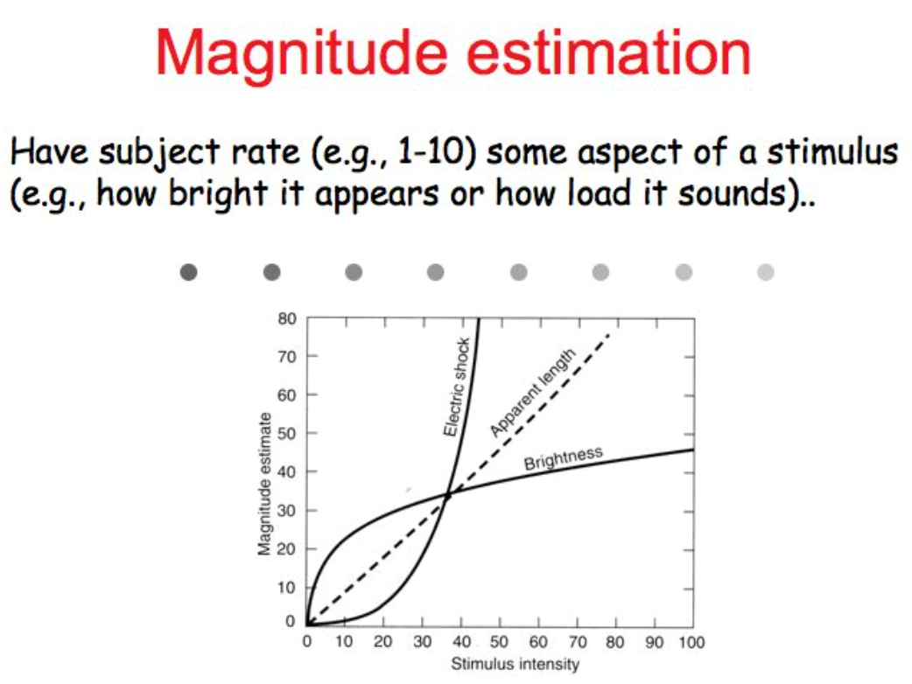
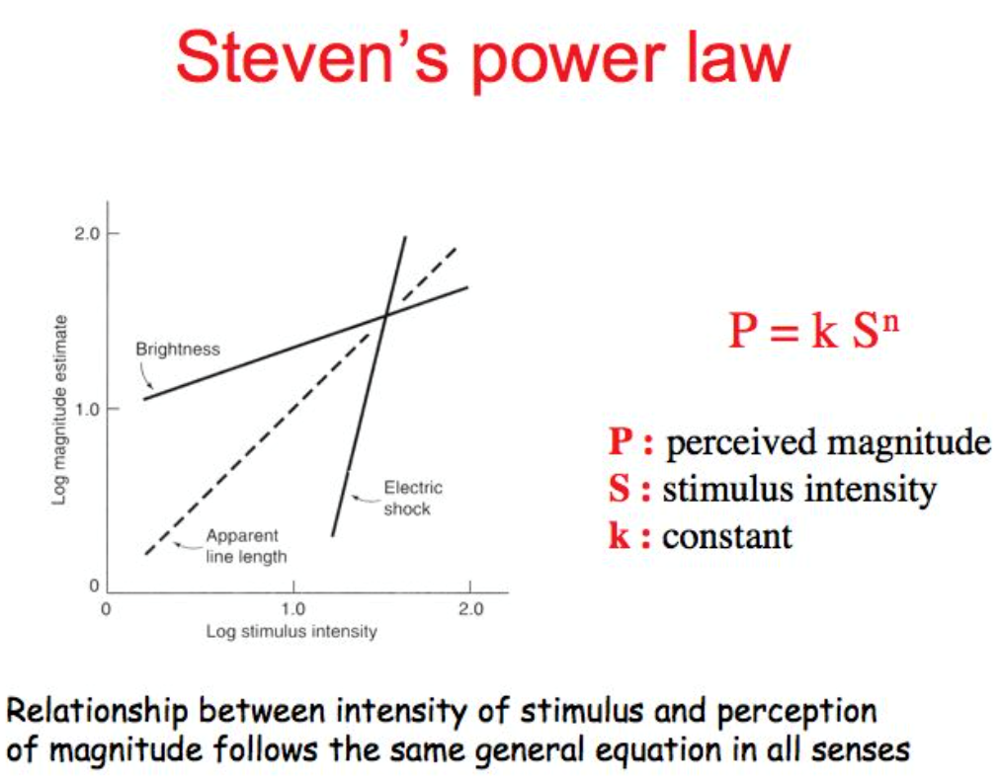
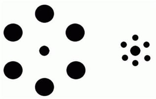
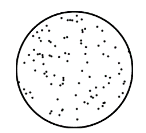
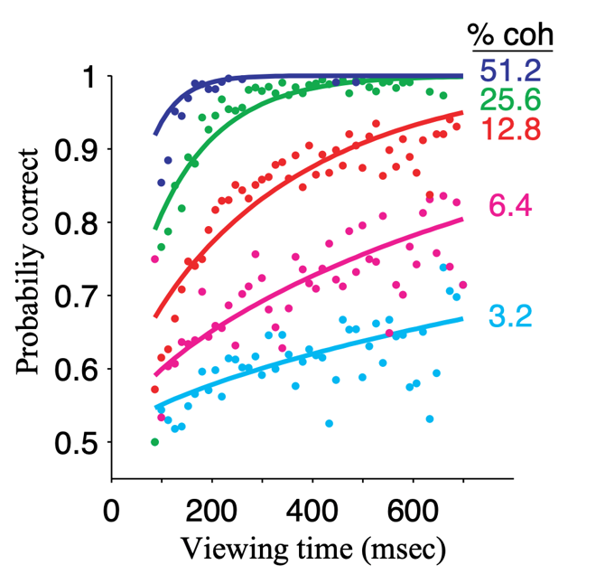

# 4.1 心理物理学基础

在讲知觉决策之前，我们不妨来回顾一下实验心理学中学过的心理物理学知识。

心理物理学（Psychophysics）是研究物理刺激（如声音、光线、温度等）与主观感知（如响度、亮度、温度感受等）之间关系的科学学科。它探讨了如何通过定量方法测量外界物理特性与个体心理体验之间的映射关系，从而揭示感知系统的工作机制及其特性。

在心理物理学中，有很多实验方法用来量化物理刺激与主观感知之间的关系。以下是几个常见的例子：

## **幅度估计（Magnitude Estimation）**

被试者根据某个特定刺激的属性（如亮度或响度）进行主观打分。通常要求被试者在一个预设的尺度上（例如1到10）为刺激的强度进行评分，从而量化主观感受与物理刺激之间的关系。例如，让被试者为不同亮度的光源打分，以评估光亮程度在主观上的变化。

<figure><figcaption>
图4-1 对亮度的幅度估计
</figcaption></figure>

Steven's幂定律（Steven's Power Law）就描述了物理刺激强度与主观感知强度之间的数学关系1。该定律表明，不同类型的感官刺激（如声音、亮度、压力）与感知强度之间的关系可以通过不同的指数n来描述。当n>1时，感知强度增长得比物理刺激强度更快（如电击感）；当n<1时，感知强度增长得比物理刺激强度更慢（如亮度感知）。

<figure><figcaption>
图4-2 Steven幂定律
</figcaption></figure>

## **匹配（Matching）**

被试者调整一个刺激的某个属性（如大小或响度），直到该刺激在某个方面（如视觉或听觉感知）与另一个刺激相匹配。这个方法用于研究个体在不同感知条件下的主观相等点（point of subjective equality, PSE）。例如，要求被试者调整右边中心圆形的大小，直到它与左边中心圆形看起来一样大。

<figure><figcaption>
图4-3 匹配任务中的大小调整
</figcaption></figure>

## **检测与区分（Detection/Discrimination）**

### 检测

被试者判断某个刺激是否存在。通常用于测量感知系统的检测阈限（detection threshold），例如询问被试者是否能听到某个特定音量的声音。

### 区分

被试者判断两个刺激中哪一个更强或更弱，或者哪个具有不同的特征。这种方法常用于测量差别阈限（difference threshold），例如判断两个音调中哪个音调更高。

常见的实验方法有调整法（Method of Adjustment）、Yes-No任务、强迫选择任务（Forced Choice Task）等。

### 调整法

在调整法（method of adjustment）中，被试可以主动调节刺激的某个属性，直到达到指定的主观标准。研究者记录多次调节的结果，并根据实验目的估计相应的心理物理指标。

例如，在检测任务中，被试可以逐渐增大或减小声音强度，直到报告刚好能够听到声音；在匹配任务中，被试可以调整一个刺激的亮度，直到它与另一个刺激在主观上相等。前者可以用于估计检测阈限，后者可以用于估计主观相等点（point of subjective equality, PSE）。如果实验要求被试调整两个刺激之间的差异，以达到某个区分标准，则可以进一步用于研究差别阈限。

调整法操作简单、测量速度较快，但结果可能受到起始刺激、调节方向、反应习惯和被试策略等因素影响。因此，研究者通常需要通过多次测量、平衡调节方向等方式降低这些影响。

### Yes-No任务

在yes-no任务中，被试在每次试验中都会接收到一个刺激，并需要回答“是”或“否”，以表示他们是否检测到了该刺激。研究人员通过一系列刺激强度（使用恒定刺激法）来测量感知阈限，并绘制心理测量函数（psychometric function）来描述被试者对不同刺激强度的反应概率。

### 迫选任务

在强迫选择任务中，被试在每个试验中需要从多个选项中进行选择（通常为2选1或4选1），例如判断两个刺激中哪一个更强。这种方法的特点尽可能减弱选择标准的影响，因为被试者必须在给定选项中做出选择，而不是自由地选择“是”或“否”。例如在区分任务中，被试需要判断两个刺激中哪个更亮、哪个更响等；而在检测任务中，被试在一个2选1的任务中，需要判断其中哪一个时间段存在刺激。

## **感知决策（Perceptual decision-making）**

随机点运动图（Random Dot Kinematograms, RDK）是感知决策研究中最经典的实验范式之一。RDK通常用于研究个体在视觉感知中的运动方向判断过程。在RDK实验中，被试者看到一个由多个随机排列的点组成的动态图形，这些点中一部分会沿特定方向（如左或右）运动，而其余点则随机移动（噪声）。被试者需要判断这些点的整体运动方向。实验中可以通过改变沿相同方向运动的点的比例（称为一致性水平，coherence level）来调节任务难度：一致性水平越高，判断越容易；一致性水平越低，判断越困难。

<figure><figcaption>
图4-4 随机点运动图
</figcaption></figure>

RDK范式能够揭示被试者在面对不确定性和噪声信息时如何进行决策，并用于分析感知过程中神经系统如何整合信息、权衡证据，最终做出决策。这种实验通常与行为数据及神经数据（如神经放电频率、fMRI信号）结合，帮助理解决策机制的神经基础。下面我们给出一个利用RDK研究感知证据累计过程的经典研究。

<figure><figcaption>
图4-5 Gold &#x26; Shadlen (2004) 结果图
</figcaption></figure>

Gold 和 Shadlen(2004) 的研究利用随机点运动图（random-dot kinematogram, RDK）任务研究感知决策的神经机制。在这一任务中，研究者通过操控沿目标方向运动的点所占的比例，即运动一致性（motion coherence），来改变刺激提供的运动方向证据。通常，一致性越高，方向证据越明确，被试的判断正确率也越高。

RDK 任务常被用于检验证据积累模型（evidence accumulation model）。这类模型假设，决策者会随着时间整合与不同选项有关的证据，并在积累到一定程度后作出选择。证据较强时，决策变量通常变化得更快，因此在其他条件相同的情况下，正确率往往更高，反应时间也可能更短。不过，具体的反应时间还会受到决策边界、非决策时间及被试策略等因素影响，不能仅凭运动一致性水平就断言所有条件下的反应时间关系。

因此，RDK 任务不仅能研究刺激强度如何影响判断准确性，还能帮助研究者分析感知证据的时间动态及其神经基础。


思考题: 请问这个RDK随机点方向判断任务，是Yes-No任务还是迫选任务?

