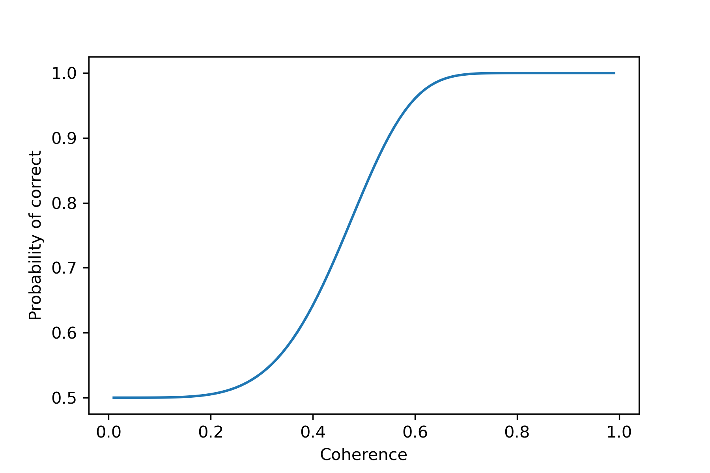
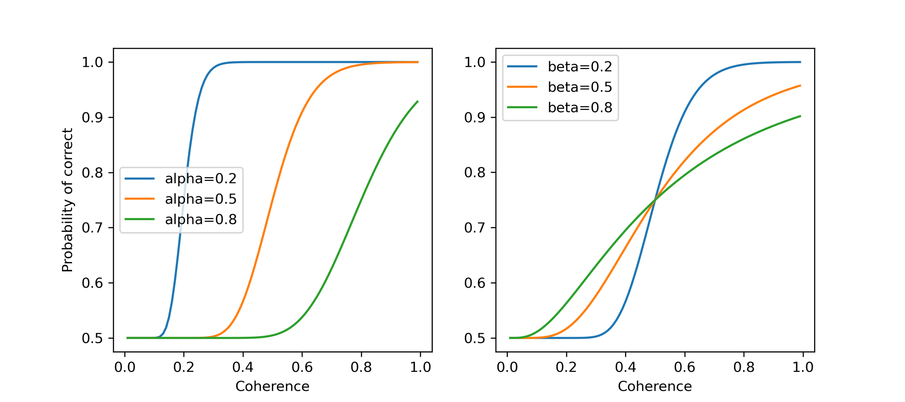
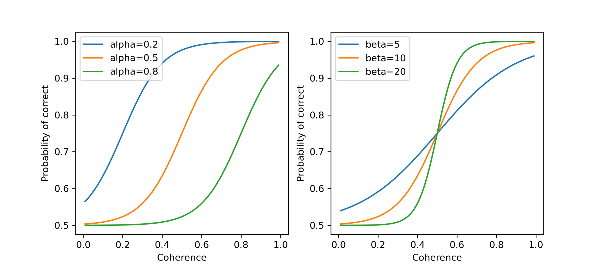
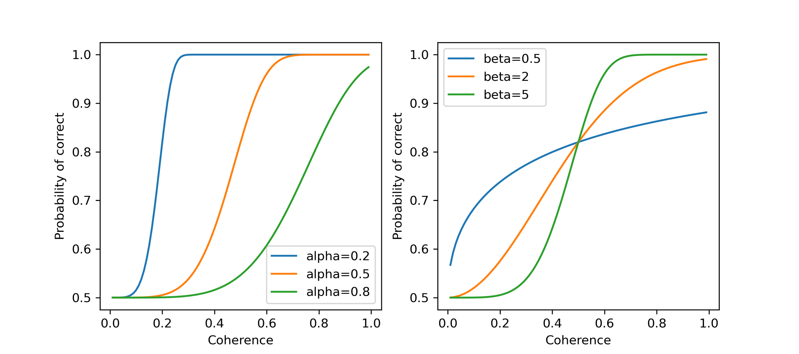

# 4.2.1 几种常见的心理物理曲线

## 什么是心理物理曲线？

心理物理曲线（Psychometric Function）定义了物理刺激与主观感知之间的关系。它通过描绘被试者对不同强度的刺激所做出的反应概率，展示了感知系统如何处理这些刺激。

<figure><figcaption><p>心理物理曲线示意图</p></figcaption></figure>

心理物理曲线通常有三个关键特征：

* **阈限（Threshold）**&#x53CA;其对应的准确率：阈限是指被试者能可靠感知到刺激的最低强度，通常定义为正确反应概率达到某个标准值（如75%准确率）的刺激强度。阈限反映了个体感知系统的敏感性，阈限越低，感知系统越敏感。
* **斜率（Slope）**：斜率代表心理物理曲线在阈限附近的陡峭程度，反映了感知系统对刺激强度变化的敏感性。斜率越大，意味着被试者对刺激强度的微小变化更加敏感；斜率越小，则说明被试者的反应变化较缓慢。
* **范围（Range）**：范围指的是被试者从随机猜测到接近100%正确率之间的物理刺激强度范围。较宽的范围表明被试者需要较大的刺激变化才能提高判断准确率，而较窄的范围则表示被试者在较小范围内即可感知变化。

## 常见的心理物理曲线

心理物理曲线可通过不同的函数形式进行拟合。以下介绍三种常见的心理物理曲线。

### **累积高斯函数（Accumulated Gaussian Function）**

数学表达式为：

$$
y=γ+(1-γ)*normcdf(x,\alpha, \beta)
$$

其中

* $$\alpha$$阈限为函数半高点所对应的刺激强度
* $$\beta$$为函数的slope
* $$\gamma$$ 为基线chance level的概率值
* `normcdf`为高斯分布的累计概率函数

我们来展示一下不同的阈限和斜率所展现出的不同效果

```python
import numpy as np
import matplotlib.pyplot as plt
from scipy.stats import norm

coh = np.arange(0.01, 1, 0.01) # coherence level

fig, ax = plt.subplots(1,2, figsize=(9, 4))

# 定义参数
gamma = 0.5 # Baseline chance level
beta = 0.2 # Gaussian分布的宽

plt.sca(ax[0])
alpha1 = 0.2 # threshold to half height  
y1 = gamma + (1-gamma) * norm.cdf(np.log(coh), loc=np.log(alpha1), scale=beta)
alpha2 = 0.5 # threshold to half height  
y2 = gamma + (1-gamma) * norm.cdf(np.log(coh), loc=np.log(alpha2), scale=beta)
alpha3 = 0.8 # threshold to half height  
y3 = gamma + (1-gamma) * norm.cdf(np.log(coh), loc=np.log(alpha3), scale=beta)
plt.plot(coh, y1, '-', label='alpha=0.2')
plt.plot(coh, y2, '-', label='alpha=0.5')
plt.plot(coh, y3, '-', label='alpha=0.8')
plt.xlabel('Coherence')
plt.ylabel('Probability of correct')
plt.legend()

# 定义参数
gamma = 0.5 # Baseline chance level
alpha = 0.5

plt.sca(ax[1])
beta1 = 0.2 # threshold to half height  
y1 = gamma + (1-gamma) * norm.cdf(np.log(coh), loc=np.log(alpha), scale=beta1)
beta2 = 0.5 # threshold to half height  
y2 = gamma + (1-gamma) * norm.cdf(np.log(coh), loc=np.log(alpha), scale=beta2)
beta3 = 0.8 # threshold to half height  
y3 = gamma + (1-gamma) * norm.cdf(np.log(coh), loc=np.log(alpha), scale=beta3)
plt.plot(coh, y1, '-', label='beta=0.2')
plt.plot(coh, y2, '-', label='beta=0.5')
plt.plot(coh, y3, '-', label='beta=0.8')
plt.xlabel('Coherence')
plt.legend()
```

运行上述代码将得到如图所示的结果，即分别调整α和β的参数值，累积高斯函数的不同形态。

<figure><figcaption></figcaption></figure>

### **Logistic函数**

数学表达式为：

$$
P(x) = \gamma+(1-\gamma)*\frac{1}{1 + e^{-\beta*(x - \alpha)}}
$$

其中

* $$\alpha$$为函数半高点所对应的刺激强度
* $$\beta$$为函数的slope，也叫inverse temperature parameter
* $$\gamma$$为基线chance level的概率值

```python
import numpy as np
import matplotlib.pyplot as plt
from scipy.stats import norm
coh = np.arange(0.01, 1, 0.01) # coherence level

def logsticfun(x, alpha, beta, gamma):
    y = gamma + (1-gamma)*1/(1+np.exp(-beta*(x-alpha)))
    return y
fig, ax = plt.subplots(1,2, figsize=(9, 4))

# 定义参数
gamma = 0.5 # Baseline chance level
beta = 10 # Gaussian 分布的宽

plt.sca(ax[0])
plt.plot(coh, logsticfun(coh, 0.2, beta, gamma), '-', label='alpha=0.2')
plt.plot(coh, logsticfun(coh, 0.5, beta, gamma), '-', label='alpha=0.5')
plt.plot(coh, logsticfun(coh, 0.8, beta, gamma), '-', label='alpha=0.8')
plt.xlabel('Coherence')
plt.ylabel('Probability of correct')
plt.legend()

# 定义参数
gamma = 0.5 # Baseline chance level
alpha = 0.5

plt.sca(ax[1])
plt.plot(coh, logsticfun(coh, alpha, 5, gamma), '-', label='beta=5')
plt.plot(coh, logsticfun(coh, alpha, 10, gamma), '-', label='beta=10')
plt.plot(coh, logsticfun(coh, alpha, 20, gamma), '-', label='beta=20')
plt.xlabel('Coherence')
plt.ylabel('Probability of correct')
plt.legend()
```

运行上述代码将得到如图所示的结果，即分别调整α和β的参数值，Logistic函数的不同形态。

<figure><figcaption></figcaption></figure>

### **Weibull函数**

数学表达式为：

$$
y = 1 - (1 - \gamma)* e^{-(\frac{k*x}{\alpha})^\beta}
$$

其中

$$
k = -\log{(\frac{1-g}{1-\gamma})^\frac{1}{\beta}}
$$

其中

* $$g$$为阈限所对应的正确率
* $$\alpha$$为该正确率下的threshold
* $$\beta$$为函数的slope
* $$\gamma$$为基线chance level的概率值

```python
# 先定义weibull函数
def weibullfun(x, alpha, beta, gamma, g):
    k = (-np.log((1-g)/(1-gamma)))**(1/beta)
    y = 1 - (1 - gamma)*np.exp(-(k*x/alpha) ** beta)
    return y
```

```python
import numpy as np
import matplotlib.pyplot as plt
coh = np.arange(0.01, 1, 0.01) # coherence level

fig, ax = plt.subplots(1,2, figsize=(9, 4))

# 定义参数
g = 0.82
gamma = 0.5 # Baseline chance level
beta = 5 # 

plt.sca(ax[0])
plt.plot(coh, weibullfun(coh, 0.2, beta, gamma, g), '-', label='alpha=0.2')
plt.plot(coh, weibullfun(coh, 0.5, beta, gamma, g), '-', label='alpha=0.5')
plt.plot(coh, weibullfun(coh, 0.8, beta, gamma, g), '-', label='alpha=0.8')
plt.xlabel('Coherence')
plt.ylabel('Probability of correct')
plt.legend()

# 定义参数
gamma = 0.5 # Baseline chance level
alpha = 0.5

plt.sca(ax[1])
plt.plot(coh, weibullfun(coh, alpha, 0.5, gamma, g), '-', label='beta=0.5')
plt.plot(coh, weibullfun(coh, alpha, 2, gamma, g), '-', label='beta=2')
plt.plot(coh, weibullfun(coh, alpha, 5, gamma, g), '-', label='beta=5')
plt.xlabel('Coherence')
plt.ylabel('Probability of correct')
plt.legend()
```

运行上述代码将得到如图所示的结果，即分别调整$$\alpha$$和$$\beta$$的参数值，Weibull函数的不同形态。

<figure><figcaption></figcaption></figure>

