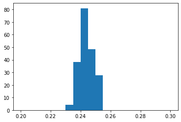

# 5.1.5 基于MCMC的参数估计

## MCMC在参数估计中的必要性


MCMC的必要性

在[第四章的心理物理曲线部分](../../di-si-zhang-xin-li-wu-li-xue-he-xin-hao-jian-ce-lun/4.2-xin-li-wu-li-qu-xian/4.2.2-ni-he-xin-li-wu-li-qu-xian.md)，我们利用最大似然估计的方法拟合了心理物理曲线。这种方法的问题在于，如果中间的隐变量无法通过积分或求和消除，就很难求解。



## **手写MH算法来估计心理物理曲线**

在第四章中，我们学习了常见的心理物理曲线，也介绍了如何用最大似然估计（MLE）来估计心理物理曲线的参数。但在更复杂的模型中，似然函数可能难以直接优化，或者我们还希望了解参数的不确定性。因此，本节将介绍如何手写 MH 算法，通过采样的方式估计心理物理曲线的参数分布。

实验任务是一个随机点运动任务。实验设置的一致性水平为\[0.032, 0.064, 0.128, 0.256, 0.512]。已知该被试的行为反应数据，包含5个一致性水平 x 1000个试次 = 5000 个试次。我们的目标是用 Weibull 函数拟合一位被试的心理物理曲线，并估计出正确率为82%阈值。

Weibull函数为

$$
y=1-(1-\gamma)exp^{-(\frac{k*x}{\alpha})^\beta}
$$

其中，

$$
k=-log(\frac{1-g}{1-\gamma})^\frac{1}{\beta}
$$

$$\alpha$$ 为给定正确率下的阈值，$$\beta$$ 为函数的斜率，$$\gamma$$ 为基线概率水平的概率值， $$g$$ 为阈值对应的正确率。

假定该被试的心理物理曲线参数组合 $$(\alpha,\beta,\gamma,g)$$ 的真值为 (0.25, 3, 0.5, 0.82)，在实验设置的一致性水平中对应的心理物理曲线如下（具体的数据模拟代码见[第四章的心理物理曲线](../../di-si-zhang-xin-li-wu-li-xue-he-xin-hao-jian-ce-lun/4.2-xin-li-wu-li-qu-xian/4.2.2-ni-he-xin-li-wu-li-qu-xian.md)）：

<figure><figcaption></figcaption></figure>

为了简化例子，这里我们只假定阈值 $$\alpha$$ 是需要估计的自由参数，其它参数皆为已知的固定参数。

首先，与最大似然估计类似，我们先写出关于 $$\alpha$$ 的负对数似然函数：

```python
import numpy as np

# 定义weibull函数
def weibullfun(x, alpha, beta, gamma, g):
    k = (-np.log((1-g)/(1-gamma)))**(1/beta)
    y = 1 - (1 - gamma)*np.exp(-(k*x/alpha) ** beta) # hack here to avoid the complex number of 
    return y

# 定义负对数似然函数
eps = np.finfo(float).eps #大于0的极小值，防止后续计算对数时出现0的情况
def negloglikeli(alpha, coh, data):
    gamma = 0.5
    g = 0.82
    beta = 3.

    prob = np.empty(coh.size)
    for i in range(coh.size):
        p = weibullfun(coh[i], alpha, beta, gamma, g)
        prob[i] = p*data[i]+(1-p)*(1-data[i])
    
    prob = prob*0.999+eps # 避免prob里面有0的情况, log(0)=-infinity
    return -np.log(prob).sum() 
    #prob取值在（0，1]，经过对数函数后会变为负数，取负的对数似然值能保证返回值是一个正数
```

如果是最大似然估计的方法，我们可以直接优化`negloglikeli` 这个函数，找到 $$\alpha$$ 让该函数值最小即可。&#x20;

而使用MH算法时，我们的目标是对从后验分布 $$p(\alpha|data)$$ 中采样。这里选择对称的高斯分布作为提议分布，并假设参数 $$\alpha$$  的先验为均匀分布，便可以使用  $$a(\alpha_j|\alpha_i)=min(1,\frac{p(data|\alpha_j)}{p(data|\alpha_i)})$$ 计算接受率。考虑到在代码实现时，直接计算似然比可能会带来数值不稳定，因此通常改用对数似然。也就是说，我们计算两次采样参数对应的对数似然差值：

$$
log[a(\alpha_j|\alpha_i)]=min(0,log[p(data|\alpha_j)]-log[p(data|\alpha_i)])
$$

MCMC采样从初始值0（可任意选取）开始，共采样2000次，剔除前1000次未平稳收敛的采样，保留后1000个有效样本。

```python
from scipy.stats import norm

nSample = 1000
nBurnin = 1000
nTotalSample = nSample + nBurnin
stepsize = 1

samples = []
oldsample = 0
```

由于提议分布是高斯分布定义在实数范围内，也是在实数范围内进行采样，但需要估计的阈限 $$\alpha$$参数范围在(0,1)，我们需要进行一个尺度转换，通过logistic函数可以将实数范围投射到(0,1)之中。

```
trans_oldsample = 1/(1+np.exp(-oldsample))
```

每次采样时，会在均值为上一采样点的高斯分布中采样，进行尺度转换后通过负对数似然函数计算接受概率，并根据随机数决定是否接受本次采样。

```python
for i in range(nTotalSample):
    ## 首先根据高斯函数采样一个新的状态/sample
    newsample = norm.rvs(loc=oldsample,scale = stepsize)
    ## 上面是在纯实数范围内采集，我们把采到的样本转化到(0,1)
    trans_newsample = 1/(1+np.exp(-newsample))

    # 计算负对数似然之差
    delta = negloglikeli(trans_oldsample, cohTrial, data)-negloglikeli(trans_newsample, cohTrial, data)
    # 接受概率
    a = np.min([0,delta]) 
    #从[0,1]均匀分布随机获取一个值
    u = np.random.rand()
    
    if np.log(u) <= a: #接受并跳转到新的采样点
        samples.append(trans_newsample)
        trans_oldsample = trans_newsample
        oldsample = newsample
    else: #保留原来的采样点不变
        samples.append(trans_oldsample)
```

完成之后可以从样本计算得到所估计参数阈限 $$\alpha$$的均值，并画出有效采样的直方图。由于模拟数据与采样具有随机性，运行的结果可能有所不同。

<pre class="language-python"><code class="lang-python"><strong>print(np.mean(samples[1000:]))
</strong><strong>plt.hist(samples[1000:], bins=20,density=True,range=[0.2,0.3])
</strong></code></pre>

<pre><code><strong>0.24384956185678375
</strong></code></pre>

<figure><figcaption></figcaption></figure>

可以看到使用MH算法估计的参数 $$\alpha$$的均值，接近参数设置的真值0.25。

在采样数量较小时，分布可能很不稳定，可以通过提高采样数量来获得更高精度，但是运行速度会更加慢。

## MCMC工具包选择指南

MCMC的算法本身和具体的模型无关，只是一种采样的方法，所以现在有许多工具包可以实现MCMC的算法。


目前的主流MCMC算法包括:&#x20;

* Metropolis-Hasting sampler&#x20;
* Gibbs sampler&#x20;
* Hamiltonian sampler&#x20;
* No-U-turn sampler

目前的主流Bayesian编程工具包包括：&#x20;

* Stan (基于C++, 有pystan, rstan接口，推荐)&#x20;
* PYMC5 (基于python，写代码方便，但是不方便写for循环)&#x20;
* Numpyro (基于python，写代码方便，但是不方便写for循环)&#x20;
* Jags, winbugs (已被淘汰，不推荐)

