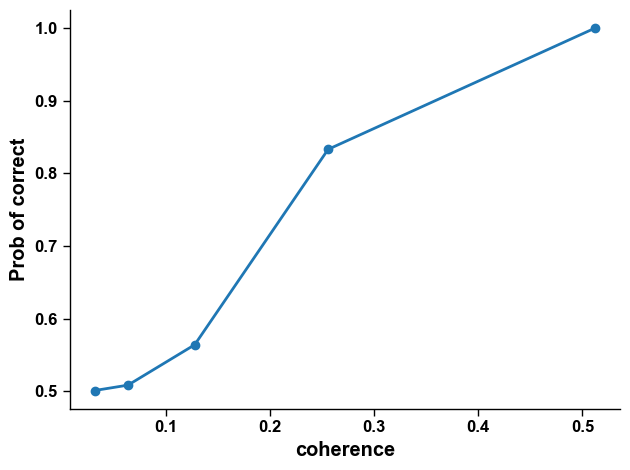
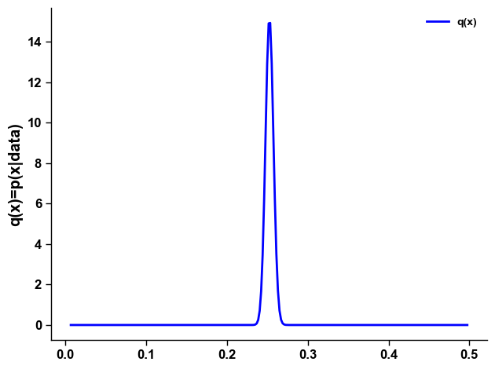

# 5.2.3 变分推断在参数估计中的应用

这一节我们同样用前面简单的心理物理曲线的例子，来解释如何用变分推断去求关于心理物理曲线后验。

Weibull函数为

$$
y=1-(1-\gamma)exp^{-(\frac{k*x}{\alpha})^\beta}
$$

其中

$$
k=-log(\frac{1-g}{1-\gamma})^\frac{1}{\beta}
$$

$$\alpha$$ 为给定正确率下的阈值，$$\beta$$ 为函数的斜率，$$\gamma$$ 为基线概率水平的概率值， $$g$$ 为阈值对应的正确率。

假定该被试的心理物理曲线参数组合 $$(\alpha,\beta,\gamma,g)$$ 的真值为 (0.25, 3, 0.5, 0.82)。在随机点运动任务中，根据不同一致性水平下的任务表现，得到的心理物理曲线如下（具体的实验设置和数据模拟代码见[第四章的心理物理曲线](../../di-si-zhang-xin-li-wu-li-xue-he-xin-hao-jian-ce-lun/4.2-xin-li-wu-li-qu-xian/4.2.2-ni-he-xin-li-wu-li-qu-xian.md)）：

<figure><figcaption></figcaption></figure>

为了简化例子，这里我们只假定阈值 $$\alpha$$是需要估计的自由参数，其它参数皆为已知的固定参数。

数学表达上，我们需要求关于 $$\alpha$$ 的后验概率分布 $$p(\alpha | data)$$。事实上，我们甚至都不确定这个后验分布一定是高斯分布，但是我们用一个高斯分布 $$q(\alpha)$$ 去近似它。

首先，与最大似然估计和 MCMC 一样，我们先写出关于 $$\alpha$$ 的负对数似然函数：

```python
import numpy as np
import matplotlib.pyplot as plt
from scipy.optimize import minimize

# 先定义weibull函数
def weibullfun(x, alpha, beta, gamma, g):
    k = (-np.log((1-g)/(1-gamma)))**(1/beta)
    y = 1 - (1 - gamma)*np.exp(-(k*x/alpha) ** beta) # hack here to avoid the complex number of 
    return y
    
eps = np.finfo(float).eps #大于0的极小数，防止计算对数时出现0
def loglikeli(alpha): # 计算模拟数据在给定参数的Weibull函数中的对数似然值
    g = 0.82 
    beta = 3
    gamma = 0.5

    prob = np.zeros(cohTrial.size)
    
    prob = weibullfun(cohTrial, alpha, beta, gamma, g)
    prob = prob*data + (1-prob)*(1-data)
    prob = prob * 0.999 + eps #防止后面计算log时出现0值
   
    return np.log(prob).sum()
```

接着，假定近似分布 $$q(\alpha)$$ 为高斯分布，其均值为 $$\mu$$ ，标准差为 $$\sigma$$。由于我们并不知道后验分布 $$p(\alpha|data)$$的真实形式，因此无法像[5.2.2](5.2.2-bian-fen-tui-duan-shi-li-gao-si-fen-bu-jin-si.md)中那样直接最小化 KL 散度，而需要通过最大化证据下界 $$L$$ 来进行近似，如公式（5-20）所示：

$$
\hat{q}(\alpha) =\arg\max_{q(\alpha)} \int (\log p(\alpha)+\log p(data|\alpha)-\log q(\alpha))q(\alpha)d\alpha
$$

同样地，为了避免直接计算积分，我们可以通过采样来近似该式：从 $$q(\alpha)$$ 中采样 $$n$$ 个样本 $$\alpha_1, \alpha_2,\dots,\alpha_n$$，然后分别计算每个样本 $$\alpha_i$$ 对应的 $$\log p(\alpha)$$，$$\log p(data|\alpha)$$ 和 $$\log q(\alpha)$$$$\log q(\alpha)$$，最后对这些结果求平均，得到 $$L$$ 的近似值：

$$
\hat{q}(\alpha) \approx \arg\max_{q(\alpha)} \frac{1}{n}\sum_i^n [\log p(\alpha_i)+\log p(data|\alpha_i)-\log q(\alpha_i)] \qquad \qquad \tag{5-22}
$$

这里我们假定参数 $$\alpha$$ 的先验 $$p(\alpha)$$ 是 $$[0,1]$$ 的均匀分布。

在代码中，我们用高斯分布生成一个无界的中间变量，然后通过 sigmoid 函数将其转换到  $$(0,1)$$  区间内，作为参数  $$\alpha$$  的样本。优化目标取为 ELBO 的相反数，因此最小化该函数就等价于最大化 ELBO。

```python
from scipy.stats import norm,uniform

samplesize = 500 # 采样数量

def lossfun(params):
    # q分布的参数
    mu = params[0] # q高斯函数的均值
    sigma = params[1] # q高斯函数的std
    
    # 对q分布进行采样
    ss = norm.rvs(loc = mu, scale = sigma, size = samplesize) # ss是(-inf, inf) # 从q分布中采500个样本
    # 计算这些样本的 logq
    llq = np.log(norm.pdf(ss, loc = mu, scale = sigma) * 0.999 + eps) 
    
    # 将采样的范围(-inf, inf)转换为系数的阈限（0，1）内
    ss = 1./(1+np.exp(-ss)) 
    llp = [loglikeli(s) for s in ss] # 求这些log(p(data|alpha))
    llp = np.array(llp) # 对于所有的ss，计算针对data的likelihood
    
    #计算先验值 log(p(alpha))
    llprior = np.log(uniform.pdf(ss, loc = 0, scale = 1) * 0.999+eps) 

    # 构建优化目标，根据公式（5-22）汇总得到L值，并取相反数
    dd = llq - llp - llprior 
    
    return dd.sum()/samplesize/cohTrial.size # 我们再除以trial数量，以保证返回数量不会太大
```

接下来优化该目标函数，得到近似分布 $$q(\alpha)$$ 的参数 $$(\mu,\sigma)$$ ，输出计算所得参数 $$\alpha$$的均值并画出近似后验分布：

```python
from scipy.optimize import minimize
res = minimize(fun=lossfun, x0=(0, 1), method='Powell', bounds=((-5, 0), (eps, 5))) 

print('The estimated parameters is', res.x)
# Gaussian distribution的均值转化成(0,1)的阈限为
print('The mean of threshold is', 1./(1+np.exp(-res.x[0])))
```

```
The estimated parameters is [-1.0848973   0.02625092]
The mean of threshold is 0.25258036744019224
```

阈限的真实值为0.25，可以发现$$q(\alpha)$$的均值非常接近这个值。

```python
# 完成之后, 我们画出分布
x = np.arange(-5., 0., 0.01)
xx = 1/(1+np.exp(-x))
plt.plot(xx, norm.pdf(x, loc=res.x[0], scale=res.x[1]), color='b', label='q(x)')
plt.legend()
plt.ylabel('q(x)=p(x|data)')
```

<figure><figcaption></figcaption></figure>
